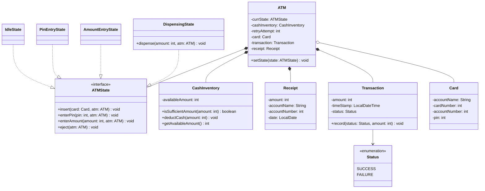
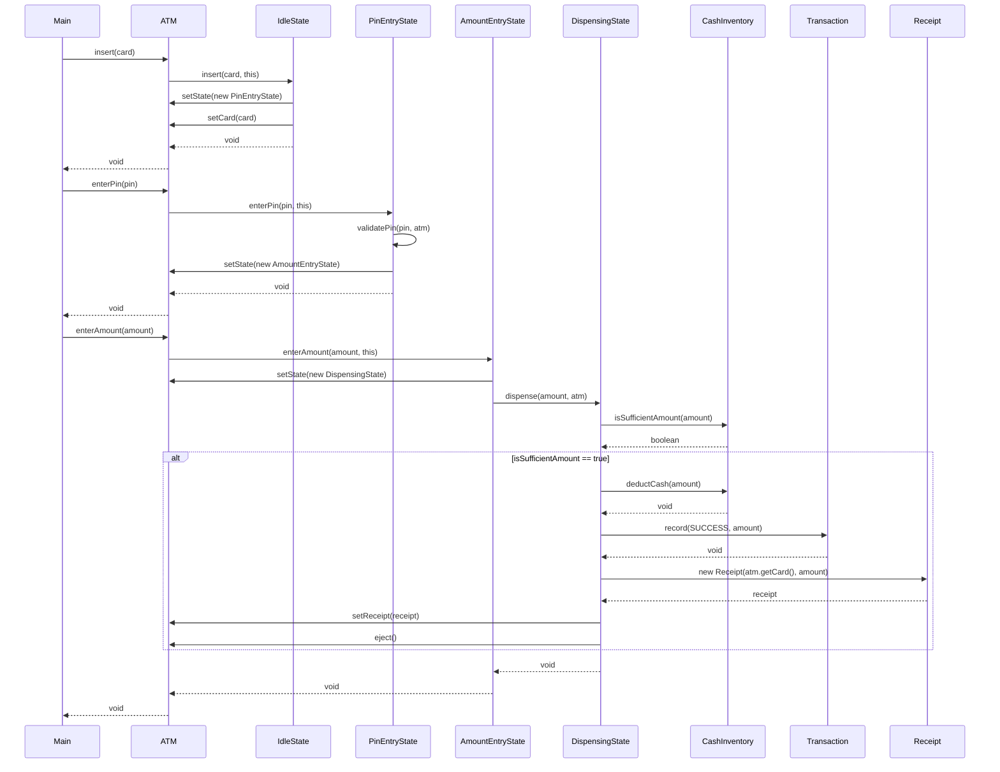
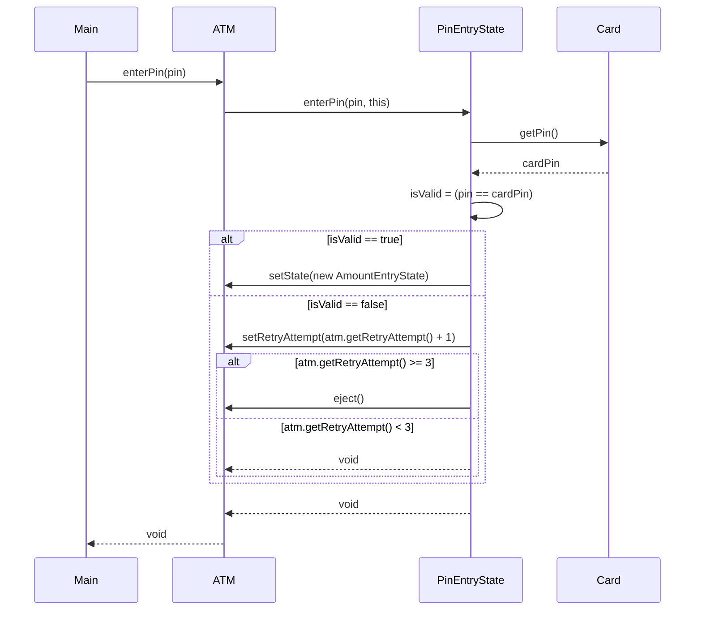
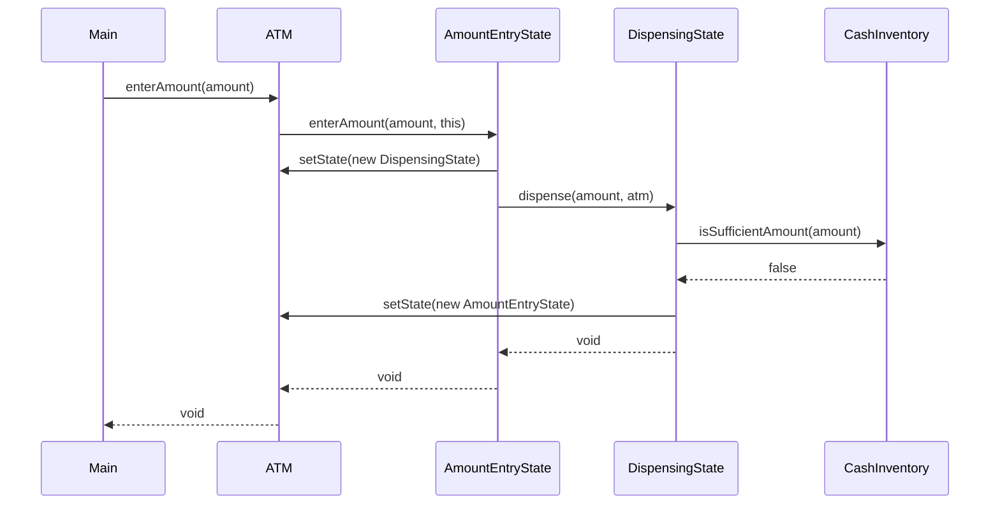

# L4 — ATM Machine

## Scope

- Card validation
- PIN validation, max 3 attempts → eject card (no actual account lock — explicitly scoped out, since simulating account unlock is out-of-band and not useful for this exercise)
- PIN entered before amount (deliberate, real-ATM-consistent ordering)
- Enter amount as a separate step, single dispensing flow triggered immediately after
- Cash sufficiency check is **ATM-side only** — assumes user always requests ≤ their actual account balance; account-balance-side insufficiency is explicitly out of scope
- Cash dispensing, Receipt generation, auto card ejection after dispensing
- Out of scope: multiple transaction types (balance inquiry, mini-statement), card-ejection-before-dispensing ordering variant, account-balance-side insufficient funds, actual account locking/unlocking

## Entities

- **ATM** — central orchestrator/context for the State pattern. Owns `currState`, `cashInventory`, `retryAttempt`, `card`, `transaction`, `receipt`. All four user-facing actions (`insert`, `enterPin`, `enterAmount`, `eject`) live here as thin public methods that delegate to `currState`.
- **ATMState** (interface) — declares `insert`, `enterPin`, `enterAmount`, `eject`, each taking the relevant data plus a reference to `ATM` itself (needed so concrete states can call back into `ATM` for `setState()`/field updates without storing an `ATM` reference internally — keeps state objects stateless/reusable).
- **IdleState / PinEntryState / AmountEntryState / DispensingState** — concrete states. Each meaningfully implements only its one "valid" transition; calls to the other three methods throw meaningful exceptions (standard State-pattern shape — most states legitimately reject most calls).
- **Card** — pure data (`accountName`, `cardNumber`, `accountNumber`, `pin`). No behavior.
- **CashInventory** — tracks ATM's physical cash (`availableAmount`), exposes `isSufficientAmount()` / `deductCash()`.
- **Transaction** — pure data + one recording method (`record(status, amount)`), captures `amount`, `timeStamp`, `status`.
- **Receipt** — pure data (`amount`, `accountName`, `accountNumber`, `date`), built from Card + Transaction info once a transaction completes.
- **Status** (enum) — `SUCCESS` / `FAILURE`.

## Key Design Decisions

- **No separate `Session` class.** Originally introduced to hold per-visit data (PIN attempt count, current card), then deliberately collapsed once traced: "only one customer at a time" doesn't require a separate Session object — `ATM` itself can hold that data directly, reset naturally each time a new customer's flow begins. This is the same category of self-correction as L3's Jump/interface collapse — reject an abstraction once it's shown to add no real behavior.
- **State objects are stateless and reusable across customers.** No per-customer data (PIN, amount, attempt count) is stored inside `IdleState`/`PinEntryState`/etc. — all persistent data lives on `ATM`, passed in as a parameter to each state method. This keeps a single instance of each concrete state shareable/reusable rather than tied to one customer's flow.
- **`amount` and `pin` are never stored as ATM fields — passed through transiently.** Both are only needed within a single synchronous call chain (compare PIN once against `card.getPin()`; pass amount straight through `enterAmount()` → `dispense()`). Applied the same stored-field-vs-parameter test used in L3 for Player/Board.
- **`card` and `retryAttempt` ARE stored fields on ATM.** Both need to persist *across separate top-level calls* from the driver (`insert()` → later `enterPin()` → later `eject()`), unlike `pin`/`amount` which live and die within one call.
- **`DispensingState.dispense()` exists only on `DispensingState`, not the shared `ATMState` interface** — since no other state needs it and it's never called directly by `Main`, only internally by `AmountEntryState`. Called directly, state-to-state, rather than routed back through `ATM` — a deliberate, knowingly-made deviation from the more common textbook shape (where states typically avoid calling each other directly to reduce coupling). Chosen here because `enterAmount()` synchronously drives the entire rest of the flow with no separate user trigger needed.
- **Auto-eject after dispensing.** `DispensingState` calls `atm.eject()` directly once dispensing/receipt-building completes — user collects card afterward, no separate manual eject step required in the success path.
- **Receipt is built by `DispensingState`**, immediately after `Transaction.record()` — it already holds `amount` and can pull card info via `atm.getCard()`, so no other class needs to own this responsibility.
- **PIN retry count increments before the exhaustion check, in the same call.** The 3rd wrong attempt both increments the count to 3 *and* triggers eject in that same `enterPin()` call — not deferred to a 4th call.
- **Insufficient-ATM-cash path returns to `AmountEntryState`, not eject.** Matches scoped flow ("enter sufficient amount or eject") — user's next `enterAmount()` call re-enters the same flow; eject remains available as a separate action from any active state.

## Patterns Used

**State — `ATM.currState : ATMState`**

- Real second/third/fourth implementation confirmed by design: `enterAmount()` genuinely behaves differently depending on current state (rejected with an exception in `PinEntryState`, proceeds to dispensing logic in `AmountEntryState`) — not just cosmetic phase-naming.
- Considered and rejected: Chain of Responsibility for cash denomination breakdown (e.g., dispensing in largest-to-smallest notes) — explicitly scoped out as a real, named, plausible extension rather than missed or force-fit.

## Design Smells Caught During This Session

- Premature entity: `Session` was introduced to hold PIN-attempt-count and current-card data, then collapsed once traced against the "does the owner need this to persist, and is a separate object actually earning its keep" test — same category of correction as L3's Jump/interface collapse.
- `Card.amount`/balance field proposed, then dropped — contradicted the explicit scope decision to not check account-side balance; a field nothing reads is dead data.
- `ATM → Card` relationship almost drawn without a backing stored field — caught via the arrow/field audit (same recurring issue flagged in L3).
- `ATM → Receipt` composition arrow initially had no matching field on `ATM` — same audit, fixed in a later pass.
- State objects almost given a stored `ATM` reference as a field (tying one state instance to one specific machine) — caught by re-applying the stored-field-vs-parameter test; resolved to pass `ATM` as a method parameter instead, keeping states reusable/stateless.
- PIN attempt-count almost placed as a field inside `PinEntryState` itself — would have broken statelessness (one customer's failed attempts leaking into the next, since state instances are shared). Corrected to live on `ATM`, with `PinEntryState` holding only the validation *logic*.
- `setPin()`/stored `pin` field on ATM proposed, then removed — PIN is only ever needed transiently for one comparison, never referenced again afterward.
- `requestedAmount` field on ATM proposed (with manual reset-to-0 on eject), then removed once traced — `enterAmount()` drives the entire dispensing flow synchronously in one call, so `amount` can be passed straight through as a parameter with no field needed at all.

## Diagrams

### Class Diagram

### Sequence Diagram — Happy Path

### Sequence Diagram — PIN Failure (3 attempts → eject)

### Sequence Diagram — Insufficient ATM Cash (retry)

