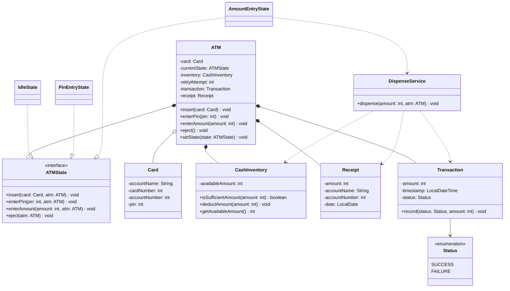
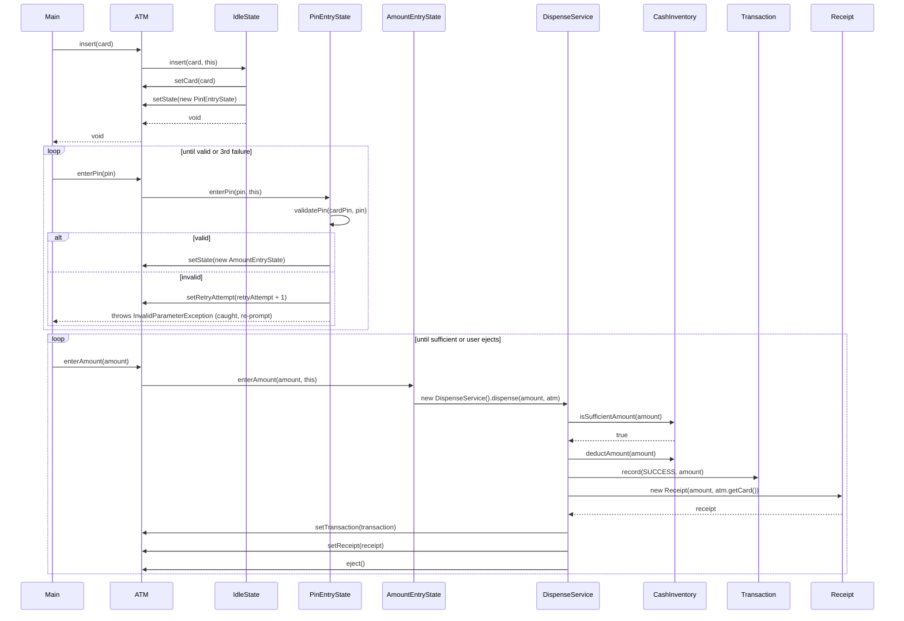
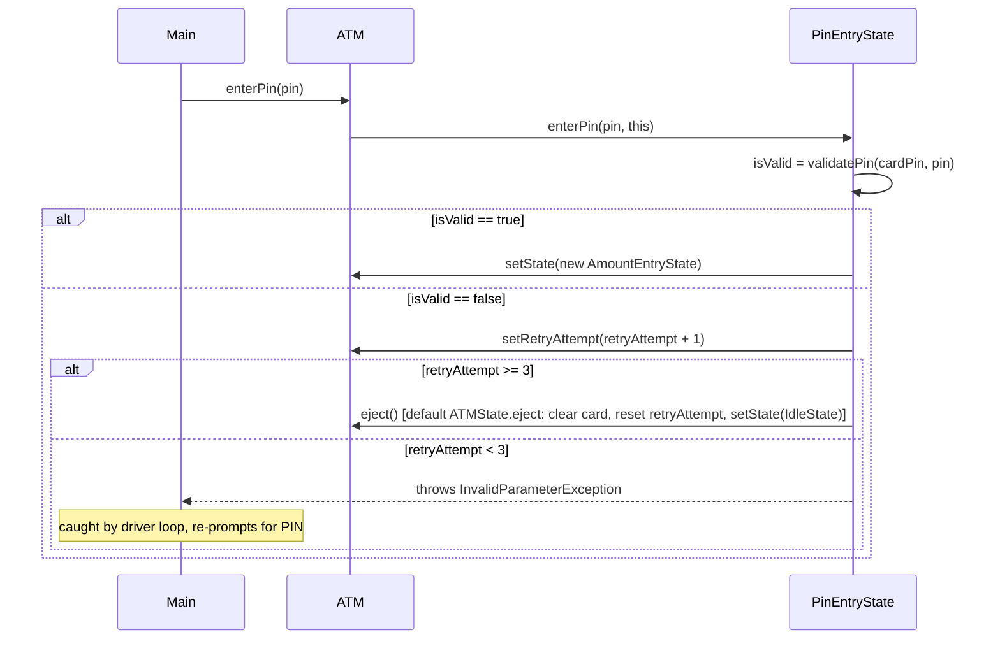
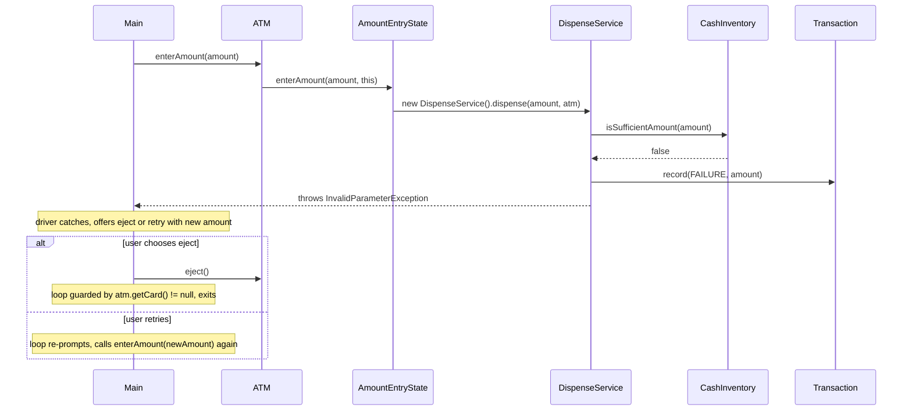

# L4 — ATM Machine

## Scope

- Card validation
- PIN validation, max 3 attempts → eject card (no actual account lock — explicitly scoped out, since simulating account unlock is out-of-band and not useful for this exercise)
- PIN entered before amount (deliberate, real-ATM-consistent ordering)
- Enter amount as a separate step, single dispensing flow triggered immediately after
- Cash sufficiency check is **ATM-side only** — assumes user always requests ≤ their actual account balance; account-balance-side insufficiency is explicitly out of scope
- Cash dispensing, Receipt generation, auto card ejection after dispensing
- Out of scope: multiple transaction types (balance inquiry, mini-statement), card-ejection-before-dispensing ordering variant, account-balance-side insufficient funds, actual account locking/unlocking

## Entities

- **ATM** — central orchestrator/context for the State pattern. Owns `currentState`, `inventory` (CashInventory), `retryAttempt`, `card`, `transaction`, `receipt`. All four user-facing actions (`insert`, `enterPin`, `enterAmount`, `eject`) live here as thin public methods that delegate to `currentState`.
- **ATMState** (interface) — declares `insert`, `enterPin`, `enterAmount`, plus a `default eject(ATM atm)` implementation shared by every state except `IdleState` (which overrides it to reject, since there's no card to eject). Each concrete state's method takes the relevant data plus a reference to `ATM` itself, passed as a parameter rather than stored — keeps state objects stateless/reusable across customers.
- **IdleState / PinEntryState / AmountEntryState** — the only three concrete states. (`DispensingState` was designed but later eliminated — see Known Deviations.)
- **DispenseService** — plain service class (not a `State`), holds the actual dispensing logic: sufficiency check, deduct cash, record transaction, build receipt, eject.
- **Card** — pure data (`accountName`, `cardNumber`, `accountNumber`, `pin`). No behavior.
- **CashInventory** — tracks ATM's physical cash (`availableAmount`), exposes `isSufficientAmount()` / `deductAmount()` / `getAvailableAmount()`.
- **Transaction** — pure data + one recording method (`record(status, amount)`), captures `amount`, `timestamp`, `status`.
- **Receipt** — pure data (`amount`, `accountName`, `accountNumber`, `date`) — snapshots primitive values out of `Card` at construction time rather than holding a live `Card` reference.
- **Status** (enum) — `SUCCESS` / `FAILURE`.

## Key Design Decisions

- **No separate `Session` class.** "Only one customer at a time" doesn't require a separate Session object — `ATM` itself holds per-visit data directly, reset naturally each time a new customer's flow begins.
- **State objects are stateless and reusable across customers.** No per-customer data (PIN, amount, attempt count) is stored inside any concrete state — all persistent data lives on `ATM`, passed in as a parameter to each state method.
- **`amount` and `pin` are never stored as ATM fields — passed through transiently.** Both are only needed within a single synchronous call chain.
- **`card` and `retryAttempt` ARE stored fields on ATM.** Both persist _across separate top-level calls_ from the driver (`insert()` → later `enterPin()` → later `eject()`), unlike `pin`/`amount`.
- **Retry loops (PIN, amount) live entirely in `ATMMain`, not inside any state.** A concrete state processes exactly one attempt per call and either transitions state or throws a recoverable exception; the driver's `while` loop is what re-prompts and calls again. Putting a loop _inside_ a state method would try to consume multiple attempts without ever getting fresh input — this was caught and fixed twice during implementation (once for PIN, once for insufficient-amount) before landing on this shape.
- **`Receipt` snapshots primitives, not a `Card` reference.** Constructor still takes `Card` (matches the natural call site, `new Receipt(amount, card)`), but internally copies out `accountName`/`accountNumber` rather than storing the `Card` object — keeps a completed receipt immutable/historically accurate even if `Card` data could change later, and avoids exposing `card.getPin()` transitively through a receipt.
- **Insufficient-ATM-cash path returns to `AmountEntryState`, does not auto-eject.** Matches scoped flow ("enter sufficient amount or eject") — user's next `enterAmount()` call retries; ejecting is a separate choice the driver offers.
- **PIN retry count increments before the exhaustion check, in the same call.** The 3rd wrong attempt increments the count to 3 _and_ triggers eject in that same `enterPin()` call.
- **`ATMMain`'s amount-entry loop is guarded by `atm.getCard() != null`.** Once the card is ejected — whether from PIN exhaustion or the user choosing to eject after insufficient funds — the loop condition itself prevents re-entry, rather than requiring an explicit `break` at every eject call site. Cleaner than manually tracking exit points.

## Patterns Used

**State — `ATM.currentState : ATMState`**

- Real behavioral fork confirmed by code: `enterAmount()` on `PinEntryState` throws, on `AmountEntryState` proceeds — not just cosmetic phase-naming.
- Considered and rejected: Chain of Responsibility for cash denomination breakdown — explicitly scoped out as a plausible extension rather than missed or force-fit.

**Why `DispenseService` is a plain service, not a `State`:** it was originally designed as `DispensingState implements ATMState`, but on implementation it never participated in polymorphic dispatch — nothing calls it via any of the three shared interface methods; it was only ever reached through a bolted-on 5th method. A "state" only ever entered through a non-interface method is a sign it isn't really part of the State hierarchy. Converting it to a plain service removed a fake state transition that nothing ever observably queried.

## Design Smells Caught During This Session

- Premature entity: `Session`, introduced then collapsed — same category as L3's Jump/interface collapse.
- `Card.amount`/balance field proposed, then dropped — contradicted the scope decision to not check account-side balance.
- `ATM → Card` and `ATM → Receipt` composition arrows initially drawn without matching stored fields — caught via arrow/field audit, same recurring issue as L3.
- State objects almost given a stored `ATM` reference as a field — caught by the stored-field-vs-parameter test, resolved to pass `ATM` as a method parameter.
- PIN attempt-count almost placed as a field inside `PinEntryState` itself — would have broken statelessness across shared instances. Corrected to live on `ATM`.
- `setPin()`/stored `pin` field, and a `requestedAmount` field on ATM — both proposed, both removed once traced; neither needed to outlive a single synchronous call.
- **`PinEntryState.enterPin()` initially contained an internal `while` loop** re-checking the same passed-in `pin` value repeatedly instead of returning control to the caller — would have spun instantly to exhaustion on a single wrong PIN, without ever getting a fresh value. Removed in favor of one comparison per call, loop moved to `ATMMain`.
- **Recursion bug, caught twice:** `PinEntryState.eject()` initially called `atm.eject()`, which redispatches to `currentState.eject()` — infinite recursion. Same mistake reappeared as `atm.enterAmount()` called from inside the insufficient-amount branch, trying to self-invoke through the state machine instead of throwing and letting the driver re-prompt. Both fixed by moving retry orchestration to `ATMMain`.
- **Off-by-one in retry exhaustion check:** `retryAttempt > 3` allowed a 4th wrong attempt before ejecting; corrected to `>= 3` to match the scoped "max 3 attempts."
- **`DispenseService.dispense()` was briefly `static`**, defeating the purpose of using an object for the operation and mismatching the eventual instance-based call site — corrected to a normal instance method.
- `Transaction`/`Receipt` objects were being constructed and used locally but never stored on `atm` — meant `atm.getTransaction()`/`atm.getReceipt()` would return stale/null data after a session. Fixed by wiring `atm.setTransaction(...)` / `atm.setReceipt(...)` at the point of creation.

## Bugs Found + Fixed (in code)

- `PinEntryState.enterPin()` used a `while` loop that re-evaluated the same passed-in PIN value repeatedly rather than processing one attempt per call — removed; one comparison per call, looping moved to the driver.
- `PinEntryState.eject()` originally called `atm.eject()`, causing infinite recursion through `ATM → currentState.eject() → atm.eject() → ...`. Resolved by making `eject()` a `default` method on `ATMState` with real logic (clear card, reset retry count, transition to `IdleState`, print message), which every concrete state except `IdleState` inherits directly rather than each re-implementing or recursing.
- Same recursion pattern reappeared in the insufficient-amount branch (`atm.enterAmount()` called from inside the state/service handling that same call) — fixed by throwing `InvalidParameterException` instead and letting `ATMMain`'s loop catch it and re-prompt.
- Retry-exhaustion check used `retryAttempt > 3` (allowing a 4th attempt) instead of `>= 3` — fixed to match the scoped 3-attempt limit.
- `validatePin(existPin, enteredPin)` was originally called with arguments in swapped order relative to the parameter names (`pin` bound to `existPin`, `card.getPin()` bound to `enteredPin`) — harmless given `==` symmetry, but misleading; corrected to match true parameter meaning.
- `DispenseService.dispense()` was declared `static` and called via the class name rather than an instance — broke the ability to treat it as a normal collaborator object; changed to an instance method.
- `Transaction` and `Receipt` were constructed inside `DispenseService.dispense()` but never attached back to `atm` — added `atm.setTransaction(...)` and `atm.setReceipt(...)` calls so they're retrievable after the session completes.
- `Main.insert(card)` had a typo (`inset`) that would have caused a naming mismatch with the driver — fixed to `insert`.
- `ATMMain`'s amount-entry loop didn't exit after the user chose to eject following an insufficient-funds message — the loop would immediately re-prompt on an already-`IdleState` machine and throw uncaught. Fixed by guarding the loop's condition on `atm.getCard() != null`, so ejecting (from any cause) naturally prevents further iterations.
- `ATM(CashInventory)` constructor had no null-check — a `null` CashInventory would defer the failure to an NPE much later, at first use. Added explicit validation, throwing immediately with a clear message.

## Known Deviations from Original Design

- **`DispensingState` was designed as a full `ATMState` implementation but eliminated during coding, replaced by `DispenseService`, a plain (non-State) class.** On implementation, it became clear `DispensingState` never participated in polymorphic dispatch through any of the three shared interface methods (`insert`/`enterPin`/`enterAmount`) — it was only ever reached via a bolted-on 5th method (`dispense()`), which is a strong signal it wasn't really a _state_ in the pattern's sense, just dispensing logic wearing a State costume. `AmountEntryState.enterAmount()` now calls `new DispenseService().dispense(amount, atm)` directly — no `atm.setState(new DispensingState())` transition happens at all, since there's no externally observable "dispensing state" distinct from `AmountEntryState`.
- **`CashInventory.deductCash()` renamed to `deductAmount()`** for naming consistency with `isSufficientAmount()` — diagram updated to match.
- **`Card` gained a `cardNumber` field**, present in the original class-diagram intent but initially missing from a first code draft — added to match.
- **`Receipt`'s constructor takes a `Card` reference (`new Receipt(amount, card)`), matching the original sequence diagram's call shape, but internally snapshots `accountName`/`accountNumber` as copied primitives rather than storing the `Card` object itself** — an intentional refinement for receipt immutability, not visible at the diagram/sequence level.
- **All retry/re-prompt looping (PIN failures, insufficient-amount failures) lives in `ATMMain`, not inside any state or service.** The original sequence diagrams show a single pass through each flow; the actual retry mechanics (driver prompts, catches a recoverable exception, loops) sit one layer above what the sequence diagrams depict, by design — consistent with the L3 precedent that the driver/orchestrator owns loops, not delegated components.

## Diagrams

### Class Diagram

### Sequence Diagram — Happy Path

### Sequence Diagram — PIN Failure (3 attempts → eject)

### Sequence Diagram — Insufficient ATM Cash (retry)

