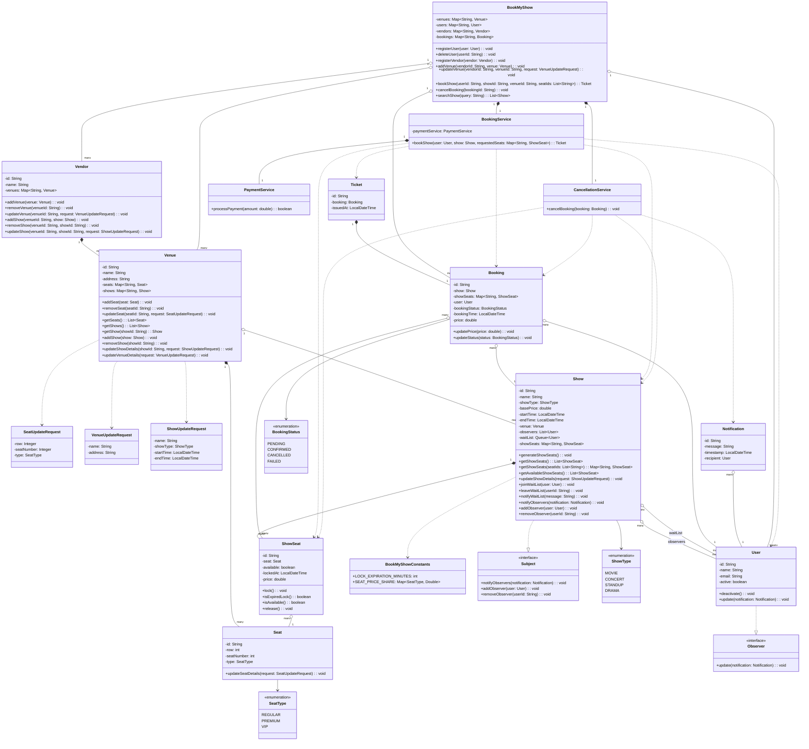
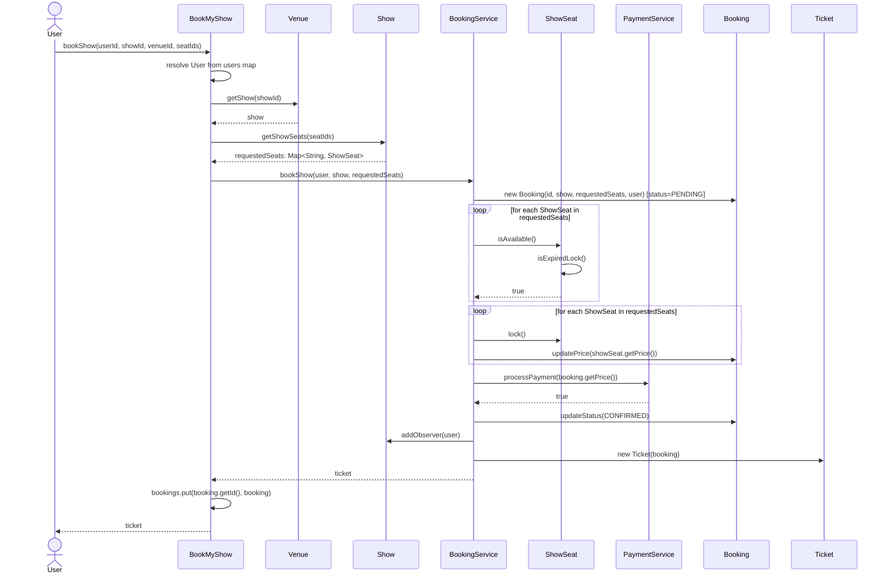
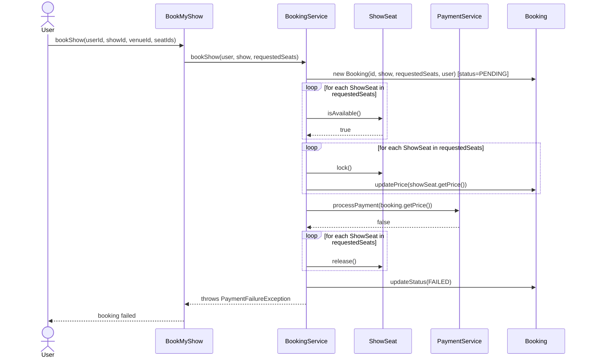
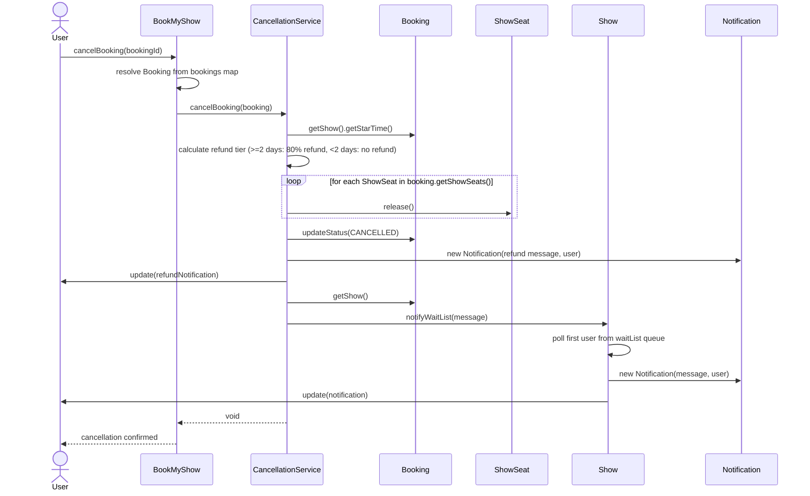
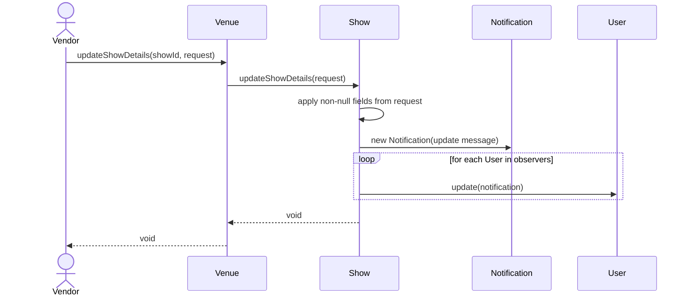

# BookMyShow — LLD Case Study Notes (L7)

## 1. Scope

**What is it?**
A platform allowing users to search shows (movie, concert, drama, standup comedy), check availability by time/place/seats, select seats, and complete a booking end-to-end (happy path).

### Scope In

| Item                                                                                                | Reasoning                                                                                  |
| --------------------------------------------------------------------------------------------------- | ------------------------------------------------------------------------------------------ |
| User register / soft delete                                                                         | Standing default (soft delete preserves booking history integrity, no orphaned references) |
| Vendor: create/configure Venue, Show, Seats, timing, base pricing                                   | Vendor is sole source of truth for bookable inventory                                      |
| Search shows → venue+timing list → seat availability                                                | Core discovery flow                                                                        |
| Seat selection with temporary lock (auto-releases on timeout **or** on payment failure/termination) | Prevents double-booking during payment window                                              |
| Payment trigger (stub, not real gateway) → ticket issuance                                          | Happy path completion                                                                      |
| Booking = 1 object holding N seats                                                                  | Confirmed early, drives `Booking`/`ShowSeat` relationship                                  |
| Cancellation with flat tiered refund (80% refund ≥2 days before show, 0% <2 days)                   | Explicitly scoped mid-design                                                               |
| Multi-event-type support (movie/concert/drama/standup), uniform seat model                          | Simplicity by deliberate design choice — no event-type-specific modeling                   |
| Vendor show-update/cancellation notifications to booked users (Observer)                            | Added as explicit scope addition mid-design                                                |
| Waitlist — join, and FIFO single-user notification when a seat frees up                             | Added as explicit scope addition mid-design                                                |

### Scope Out

| Item                                                                          | Reasoning                                                             |
| ----------------------------------------------------------------------------- | --------------------------------------------------------------------- |
| Actual payment gateway integration                                            | Simulated/stubbed only                                                |
| Authentication / Authorization                                                | Registration exists, login/session security doesn't                   |
| Recommendation / suggestion engine (trending shows, personalized suggestions) | Explicitly deferred — distinct from the in-scope notification feature |
| Event-type-specific seat modeling (GA vs. assigned)                           | Deliberately uniform per design choice                                |

---

## 2. Entities & Behavior

### Domain / Entity Classes

**`Vendor`** — `id`, `name`, `venues: Map<String, Venue>`
`addVenue`, `removeVenue`, `updateVenue`, `addShow`, `removeShow`, `updateShow`

**`Venue`** — `id`, `name`, `address`, `seats: Map<String, Seat>`, `shows: Map<String, Show>`
`addSeat`, `removeSeat`, `updateSeat`, `getSeats`, `getShows`, `getShow(showId)`, `addShow`, `removeShow`, `updateShowDetails`, `updateVenueDetails`

**`Seat`** (physical, venue-owned, persists across shows) — `id`, `row`, `seatNumber`, `type: SeatType`
`updateSeatDetails`

**`Show`** _(implements Subject)_ — `id`, `name`, `showType`, `basePrice`, `startTime`, `endTime`, `venue`, `observers: List<User>`, `waitList: Queue<User>`, `showSeats: Map<String, ShowSeat>`
`generateShowSeats`, `getShowSeats()`, `getShowSeats(seatIds)`, `getAvailableShowSeats`, `updateShowDetails`, `joinWaitList`, `leaveWaitList`, `notifyWaitList(message)`, `notifyObservers`, `addObserver`, `removeObserver`

**`ShowSeat`** (per-show, mutable bookable instance) — `id`, `seat: Seat`, `available`, `lockedAt`, `price`
`lock`, `isExpiredLock`, `isAvailable` (lazy-checks + auto-releases expired locks), `release`

**`User`** _(implements Observer)_ — `id`, `name`, `email`, `active`
`deactivate` (soft delete), `update(notification)`

**`Booking`** (pure data) — `id`, `show`, `showSeats: Map<String, ShowSeat>`, `user`, `bookingStatus`, `bookingTime`, `price`
`updatePrice`, `updateStatus`

**`Ticket`** (pure receipt) — `id`, `booking`, `issuedAt`

**`Notification`** (pure data) — `id`, `message`, `timestamp`, `recipient: User`

**`Observer`** _(interface)_ — `update(Notification)`
**`Subject`** _(interface)_ — `notifyObservers`, `addObserver`, `removeObserver`

### Coordinators / Services

**`BookMyShow`** — top-level coordinator; `venues`, `users`, `vendors`, `bookings` maps
`registerUser`, `deleteUser`, `registerVendor`, `addVenue`, `updateVenue`, `bookShow`, `cancelBooking`, `searchShow`

**`BookingService`** — `bookShow(user, show, requestedSeats)`: two-phase check-then-lock, payment call, confirm/release

**`CancellationService`** — `cancelBooking(booking)`: refund-tier calculation, seat release, status update, refund + waitlist notification

**`PaymentService`** — `processPayment(amount): boolean` (stub, always succeeds — no real gateway in scope)

### DTOs (Builder-constructed, nullable/optional fields — partial-update pattern)

`VenueUpdateRequest`, `ShowUpdateRequest`, `SeatUpdateRequest`

### Constants

`BookMyShowConstants` — `LOCK_EXPIRATION_MINUTES`, `SEAT_PRICE_SHARE: Map<SeatType, Double>`

---

## 3. Design Patterns + Why

| Pattern      | Where                                                          | Why (three-test verdict)                                                                                                                                                                                                                                                                                                   |
| ------------ | -------------------------------------------------------------- | -------------------------------------------------------------------------------------------------------------------------------------------------------------------------------------------------------------------------------------------------------------------------------------------------------------------------- |
| **Observer** | `Show` (Subject) / `User` (Observer)                           | Real varying trigger (show update/cancel, seat-freed), real one-to-many dispatch (booked users), real second-implementation potential (any object could subscribe). Earned via requirements — initially rejected as "none, deliberately" like L5, then justified once notification/waitlist was explicitly added to scope. |
| **Builder**  | `VenueUpdateRequest`, `ShowUpdateRequest`, `SeatUpdateRequest` | Genuine optional-field construction problem — partial updates need to represent "unset" distinctly from "explicitly zero/null," and callers only specify the fields changing. Scoped narrowly to update-request DTOs only; domain objects themselves are plainly constructed.                                              |

**Rejected on inspection:** Strategy (refund is one flat rule, no second implementation), Factory (seat generation is uniform iteration, no varying construction logic), State (BookingStatus is a plain enum, no state-dependent behavior branching).

---

## 4. Class Diagram

---

## 5. Sequence Diagrams

### Book Show — Happy Path

### Book Show — Payment Failure

### Cancel Booking

### Vendor Updates Show Details

---

## 6. Key Design Decisions

- **`Seat` vs. `ShowSeat` split** — the single largest design decision of L7. A single seat-object model breaks multi-showtime booking (the same physical seat must be independently bookable across different shows at the same venue). Resolved by separating the venue-owned, physical, created-once `Seat` from the per-show, mutable, lockable `ShowSeat` (aggregation reference from `ShowSeat` to `Seat`; composition from `Show` to `ShowSeat`).
- **Lazy-check seat lock expiry** (vs. `ScheduledExecutorService`) — deliberately chosen over active scheduling after tracing the concurrency/race-condition risk of a scheduled task firing after a booking already resolved (success or failure). Matches market-standard approach for this LLD scope.
- **Vendor sets base price per show; `SeatType` acts as a percentage multiplier** — more realistic than either a flat per-type constant or full vendor-controlled per-seat-type pricing; base price varies by show, relative seat-tier premium (`REGULAR`/`PREMIUM`/`VIP`) stays consistent system-wide via `BookMyShowConstants.SEAT_PRICE_SHARE`.
- **Two-phase check-then-lock in `BookingService`** — availability is checked for _all_ requested seats before _any_ are locked, preventing a partial-lock state if one seat in a multi-seat request turns out to be unavailable mid-loop.
- **`BookMyShow` resolves all IDs into objects before delegating to services** — `BookingService`/`CancellationService` never see raw IDs, keeping them pure-process; the top-level coordinator owns id-to-object resolution via its maps.
- **Map-based storage everywhere lookup-by-id is the access pattern** (`Venue.seats`, `Venue.shows`, `Show.showSeats`, `Vendor.venues`, `BookMyShow`'s four maps) — List retained only where the access pattern is pure iteration/FIFO-pop (`Show.observers`, `Show.waitList`, `Booking.showSeats`... actually `Booking.showSeats` is a Map, iterated as a whole).
- **`Vendor.venues` and `BookMyShow.venues` both hold references to the same `Venue` objects** — not duplication in a harmful sense; `Vendor`'s map represents ownership, `BookMyShow`'s represents a flat O(1) lookup index. Mutations via `updateVenueDetails()` are visible through both automatically since they reference the same object; only `addVenue` requires touching both maps (two independent map insertions).
- **`bookShow` takes `venueId` explicitly** (deviation from originally locked signature) — matches the actual user journey (navigate into a venue, then a show) and avoids relying on `showId` global uniqueness as the only lookup path.
- **`notifyWaitList` takes a `String message`, not a `Notification` object** — `Show` (not the caller) determines the recipient by popping its own waitlist queue, so constructing a full `Notification` before the recipient is known would be backwards; `Show` builds the `Notification` internally once it has the recipient.

---

## 7. Design Smells Caught (self-corrected during design/review)

- Original `Seat` model conflating physical seat definition with per-show availability state — caught and split before it reached code.
- `Venue.book()` considered, then rejected — mixing vendor-owned inventory concerns with user-facing transactional booking orchestration in one class.
- `SeatAssignmentService` proposed, then self-identified as overengineering (no auto-assignment requirement existed) and dropped.
- `ScheduledExecutorService`-based lock expiry considered, traced for a stale-task race condition (task firing after booking already resolved), reverted to lazy-check.

---

## 8. Bugs Found + Fixed (during code review)

| Bug                                                                                                                              | Location                                    | Fix                                                                           |
| -------------------------------------------------------------------------------------------------------------------------------- | ------------------------------------------- | ----------------------------------------------------------------------------- |
| Inverted boolean guards (`!Objects.nonNull(...)`) on partial-update fields                                                       | `Seat.updateSeatDetails()`                  | Removed negation — same guard-polarity bug class flagged in L6, recurred here |
| `ShowSeat.isAvailable()` didn't call `isExpiredLock()`/`release()` — lazy-check mechanism designed but not wired in              | `ShowSeat.isAvailable()`                    | Added expiry check + auto-release before returning                            |
| String reference-equality (`==`) instead of `.equals()` on user ids, in 4 places                                                 | `Show` (observer/waitlist existence checks) | Replaced all four with `.equals()`                                            |
| Inverted payment-success branch — booking marked `CONFIRMED` on failure and vice versa                                           | `BookingService.bookShow()`                 | Swapped branches                                                              |
| Partial-lock bug — check-and-lock combined in one loop, leaving earlier seats locked if a later seat failed availability         | `BookingService.bookShow()`                 | Split into two-phase loop: check all, then lock all                           |
| Refund tier compared `bookingTime` (when ticket was bought) instead of current time (when cancelled) against show start          | `CancellationService.getRefundAmount()`     | Changed to `LocalDateTime.now()`                                              |
| Off-by-one at exactly-2-days refund boundary (`> 2` excluded the boundary case)                                                  | `CancellationService.getRefundAmount()`     | Changed to `>= 2`                                                             |
| `Notification.toString()` said "from user" for the recipient field                                                               | `Notification`                              | Corrected to "to user"                                                        |
| `BookMyShow.deleteUser()` / `bookShow()` guards inverted (`containsKey` without negation)                                        | `BookMyShow`                                | Fixed negations                                                               |
| `BookMyShow.registerVendor()` never called `.put()` — vendor check passed but was never stored                                   | `BookMyShow.registerVendor()`               | Added missing `put()`                                                         |
| `BookMyShow.addVenue()` stored venue keyed by `vendorId` instead of `venueId`                                                    | `BookMyShow.addVenue()`                     | Corrected map key                                                             |
| `Venue.getShows()` (returns `List`) used with `.containsKey()`/`.get()` as if it were a `Map` — wouldn't compile                 | `BookMyShow.bookShow()` (early draft)       | Added `Venue.getShow(showId)` for direct id-based lookup                      |
| `Show.updateShowDetails()` didn't call `notifyObservers()` — Observer feature designed but not wired into the actual update path | `Show.updateShowDetails()`                  | Added `notifyObservers()` call at the end of the method                       |
| `generateShowSeats()` never invoked anywhere in the booking lifecycle                                                            | `Vendor.addShow()`                          | Added `show.generateShowSeats()` call immediately after `venue.addShow(show)` |

---

## 9. Known Deviations

- **`Seat`/`ShowSeat` split** — more classes than the typical single-`Seat`-with-status-field standard solution, but necessary; a single-seat model breaks multi-showtime booking. Deliberate improvement, not scope creep.
- **Observer (notifications) + waitlist** — present in some but not all standard BookMyShow writeups; included here because explicitly added to scope mid-design.
- **`PaymentService.processPayment()` always returns `true`** — no real gateway in scope. The payment-failure path in `BookingService` (release locks, mark `FAILED`, throw `PaymentFailureException`) is fully implemented and matches its locked sequence diagram, but is not exercisable in the current demo since the stub cannot produce `false`.
- **`searchShow` is a single case-insensitive substring match** — deliberately simple per scope; does not handle fuzzy matching, typos, or multi-word/out-of-order queries (e.g., "avenger xxx" would not match "Avengers: Endgame"). Noted as an accepted limitation, not a gap.
- **`Vendor.email` field dropped from the diagram** — was present in the original diagram draft but never implemented in code; diagram corrected to match actual code rather than code changed to match diagram.

---