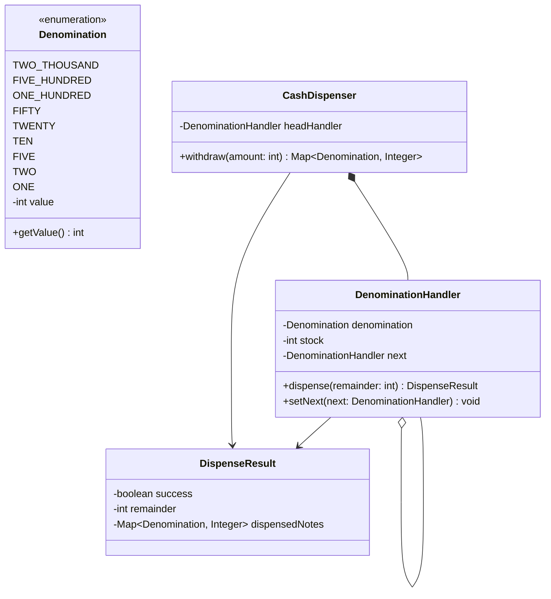
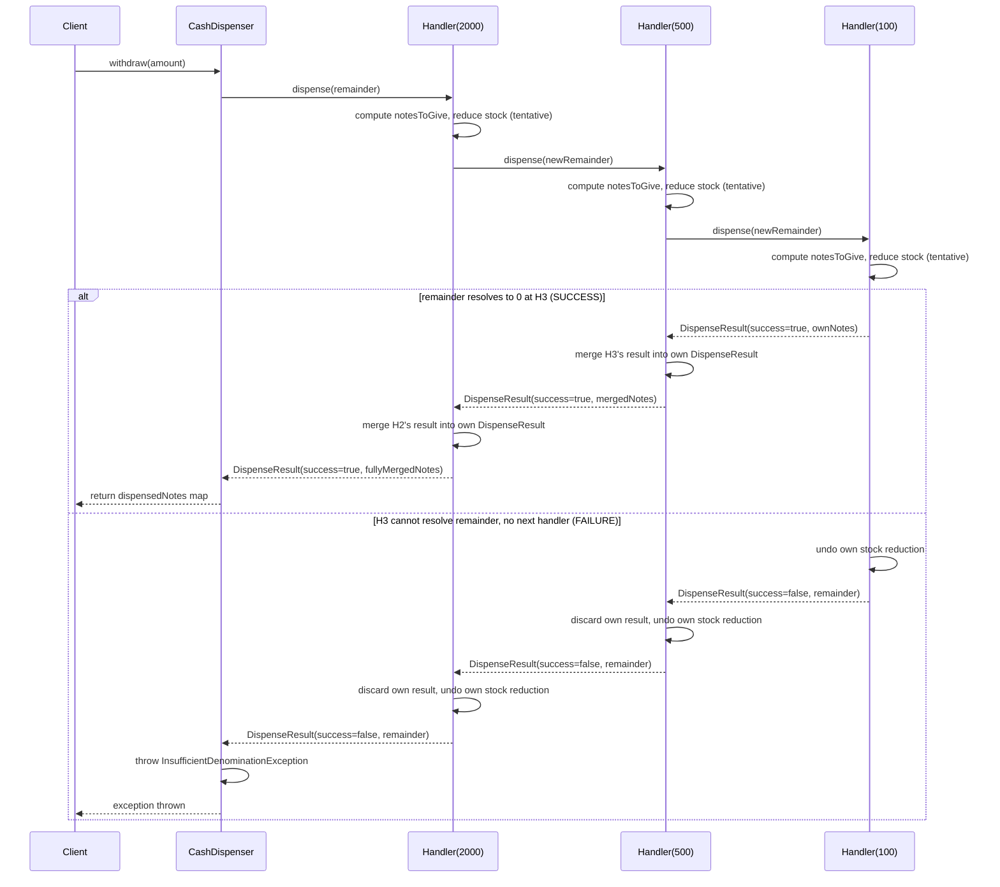

# L12 — Cash Dispenser (Chain of Responsibility)

## Requirements

**In scope:**

- Given a withdrawal amount, break it into physical notes across a fixed set of denominations
- Each denomination handler tracks its own finite stock, decrements as it dispenses
- Chain of Responsibility: each handler takes what it can of the remaining amount, passes the leftover down to the next handler
- Full transaction rollback if the chain is exhausted and the amount isn't fully resolved — no partial dispense ever

**Out of scope:**

- Concurrent withdrawals / thread-safety on stock decrements (deferred to L16 — Rate Limiter/concurrency track)
- Card/PIN/ATM state-machine flow (that's L4's ATM v1 — this case study is scoped purely to the dispensing sub-problem)

## Class Diagram

## Sequence Diagram

**Produced this session** — first multi-object handoff case study since L10
(File System cascading delete / Dropbox two-direction traversal). Unlike L11
(single-object, single-call mutations only), CoR's entire mechanism _is_
multi-handler handoff, so the diagram earns its place: it's the only way to
see the merge-on-success vs. discard-and-rollback-on-failure contrast play
out across the call stack.

## Key Concepts

- **Single generic `DenominationHandler` class, no subclass-per-denomination.**
  All handlers run identical logic (`min(remainder/denom, stock)`, decrement,
  recurse/return); only the denomination value and stock count differ across
  instances — that's data varying, not behavior varying. Composition/
  parameterization satisfies CoR's structural role (chained, interchangeable
  handlers, common interface) without needing 9 near-empty subclasses.
  Directly contrasted against State (L4/L8 ATM), where subclasses had
  genuinely different method bodies — that's what actually earns subclassing.
- **Rollback via call-stack unwind, no explicit backtracking structure.**
  Java's call stack already visits every handler in reverse order as
  `dispense()` calls return. Each handler checks the child's
  success/failure right before returning to its own caller, and undoes its
  own tentative stock change if needed — no manual stack/list required to
  achieve backtracking.
- **One `DispenseResult` per handler, merged only on success, discarded on
  failure** — not a single shared mutable result passed down and appended
  to. Stock is real external state and must be eagerly mutated with
  explicit rollback; the DTO is a transient return-value construct that
  never needed eager mutation, so merge-on-the-way-back-up avoids needing
  symmetric "undo" logic for something that isn't real state.
- **`setNext()` setter instead of constructor injection** for the `next`
  link — see Known Deviations.
- **Coordinator (`CashDispenser`) never touches the chain directly** — one
  call out to the head handler, one `DispenseResult` back. All exception
  throwing lives in the coordinator; the chain itself only ever reports,
  never throws.

## Bugs Found + Fixed

1. **Stale remainder on failure propagation (self-fixed on second attempt):**
   first implementation returned the handler's own local `newRemainder`
   (computed before calling `next`) on the failure path instead of
   `childDispenseResult.getRemainder()` — the true unresolved amount from
   deeper in the chain. Caught by tracing a concrete example (₹800 through
   `FIVE_HUNDRED` → `HUNDRED`), fixed correctly once traced with real
   numbers.
2. **Missing `TWO(2)` denomination** — dropped between the requirements
   lock and the class diagram → code translation. Caught on enum review
   before implementation went further.
3. **Getter/field name mismatch** (`getDispenseNotes` vs `getDispensedNotes`)
   — DTO getter renamed for grammatical consistency with the field name;
   required a follow-up fix at the one call site in `DenominationHandler`
   that was initially missed.
4. **Flawed failure-test design (self-caught via hand-trace, before
   running):** first rollback test starved `TWO`'s stock but left `ONE`
   with ample stock (5) — since `ONE` can always mop up any small leftover
   remainder, the "forced failure" scenario silently succeeded instead.
   Correctly diagnosed that as long as `ONE` has sufficient stock, the
   chain can almost never fail (it acts as an unconditional escape hatch),
   and fixed by reducing `ONE`'s stock to the exact boundary (1) to force
   a genuine unresolvable remainder.

## Known Deviations

**`setNext()` setter used instead of constructor-injected `next`.**
Class diagram showed `next` as a composed field; implementation uses a
setter instead. Justified: constructor injection would force reverse-order
chain construction (last handler must be built first, since every
constructor call needs its `next` already built). Setter-based wiring
allows natural forward-order construction (`2000 → 500 → ... → 1`) with
linking done in a separate pass. Class diagram left as-is (not updated) —
treated as an implementation-level deviation, reasoned and accepted rather
than silently diverging or treated as equivalent to the original design
without justification.

---
