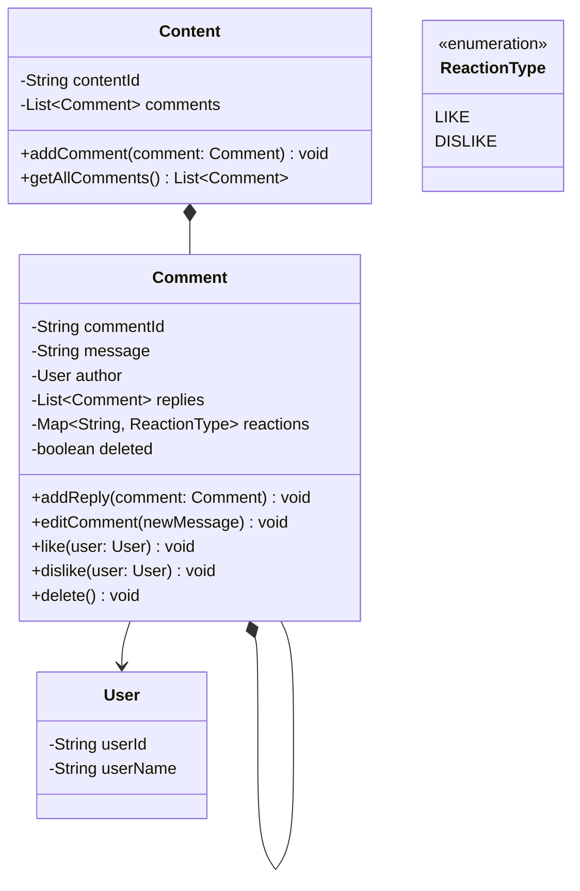

# L11 — Comment Section (Composite, nested tree)

## Requirements

**In scope:**

- Add comment under a `Content` (top-level)
- Reply to any comment, unbounded nesting depth
- Edit comment (plain mutation)
- Soft-delete comment (flag-based; content hidden, structure/children retained)
- Like / dislike a comment, tracked per-user, toggle-capable

**Out of scope:**

- Sorting / ranking replies
- Pagination
- Rate limiting
- Moderation / flagging
- Notifications

## Class Diagram

## Sequence Diagram

**Deliberately not produced this session.** Every operation in this case study
(`like`, `dislike`, `editComment`, `addReply`, `delete`) is a single-object,
single-call mutation on `Comment` — no multi-object handoff, no cross-object
coordination, no async/observer fan-out. A sequence diagram would reduce to a
single caller→`Comment` arrow per operation and wouldn't reveal anything the
method signatures don't already say. Contrast with L9/L10, where cascading
delete and two-direction Observer traversal genuinely needed one. This is a
"what would the diagram actually reveal" test, not a blanket "small case study
= skip" rule — expect sequence diagrams to return in L12+ once multi-object
interaction (Chain of Responsibility, concurrency) is back in play.

## Key Concepts

- **Self-composing Composite, no leaf/composite split.** Unlike File System
  (`File` vs `Directory`, structurally different), every `Comment` here can
  hold replies — an empty `replies` list _is_ the leaf case, not a separate
  type. `Comment *-- Comment` is the entire pattern; no abstraction layer
  needed since there's only ever one shape.
- **`Content` is not part of the Composite hierarchy.** It's a plain entity
  that _owns_ the top-level `List<Comment>`; it's never treated
  polymorphically with `Comment`.
- **Single-flag soft delete.** `deleted` is the sole source of truth. Delete
  does not cascade, does not touch children, does not touch the message
  field, and does not touch the reactions map — those all stay exactly as
  they were. `Comment` returns real data unconditionally from its getters
  (`getMessage()`, `getReactions()`); it is the _caller/renderer_ that
  decides how to display a deleted comment (e.g. `Main.printComment()`
  substitutes `[deleted]` for the message), not the entity itself.
- **Selective gating on `deleted`.** `like()`, `dislike()`, and
  `editComment()` all mutate the comment's own state and are blocked once
  `deleted` is true. `addReply()` does not mutate the deleted comment at
  all — it just attaches an independent new node nearby — so it remains
  allowed on a deleted comment. The guard lives inside `Comment` itself
  (not a caller-side check), since `Comment` already owns the data that
  defines the invariant.
- **Map-based, per-user, toggleable reactions.** `Map<String, ReactionType>`
  keyed by `userId` (a `String`), not by `User` object — deliberate, to
  avoid relying on `User` having correctly overridden `equals()`/
  `hashCode()`, and because the map only ever needs the id. Single map
  with `LIKE`/`DISLIKE` values (no `IDLE` state — considered and dropped;
  "not present" already represents neutral, and an explicit `IDLE` value
  wasn't cheaper at the data-structure level and carried no meaning the
  system needed). Toggling the same reaction removes the entry; the
  opposite reaction overwrites it.
- **One-directional reference only.** `Comment → User` (author), no
  `User → List<Comment>` back-reference — nothing in scope needs
  "all comments by a user," so it wasn't added speculatively.

## Bugs Found + Fixed

1. **Toggle logic bug (self-caught via trace-through):** initial `like()` /
   `dislike()` only handled "same reaction again → remove"; switching from
   an existing opposite reaction (e.g. `DISLIKE` → `like()`) fell through
   both branches and left the map unchanged instead of overwriting it.
   Fixed by adding the explicit else-branch to overwrite on mismatch.
2. **`addReply()` incorrectly gated on `deleted`** in an early pass —
   contradicted the explicitly locked decision that replying under a
   deleted comment must remain allowed. Caught on review, fixed by
   removing the guard from `addReply()` only.
3. **Exception semantics/naming:** started as `CommentNotFoundException`,
   which was inaccurate — the comment is never actually missing, it's in a
   deleted state. Renamed to `DeletedCommentException`; error messages
   updated from generic/copy-pasted ("Comment is not exist!", wrong action
   name across methods) to accurate, per-method messages.

## Known Deviations

None. Design and implementation stayed on the canonical Composite shape
(single self-referencing class, no artificial leaf/composite split) with no
unjustified departures.

One deviation was _proposed_ mid-session (hiding reactions on a deleted
comment via `getReactions()`) but was correctly identified as contradicting
the already-locked "delete only flips the flag, nothing else mutates"
decision, and was dropped rather than adopted — logged here per process, not
because it shipped.

## Process Note (carried into L12)

Second occurrence, same shape as the L10 flag: momentarily doubting a
correct, already-justified, locked design when asked to double-check it —
this time over `getReactions()` behavior on a deleted comment — before
re-confirming the original decision was right. Recovery was faster this
session (caught mid-conversation, no full re-derivation needed), but the
underlying instinct — checking "is something wrong" against the actual
locked spec _before_ proposing a code change — is still worth watching in
L12.
