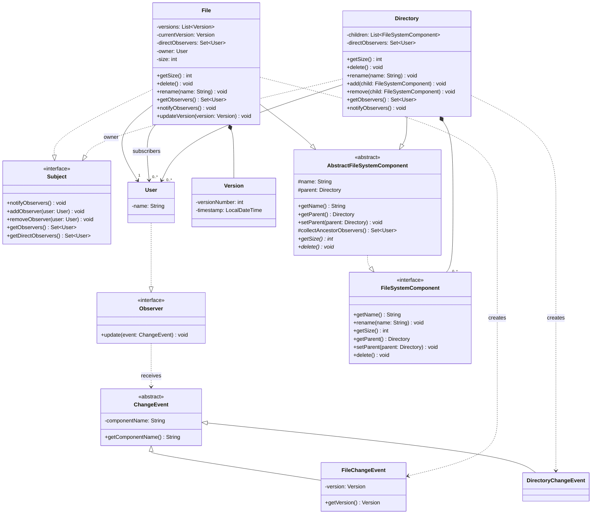
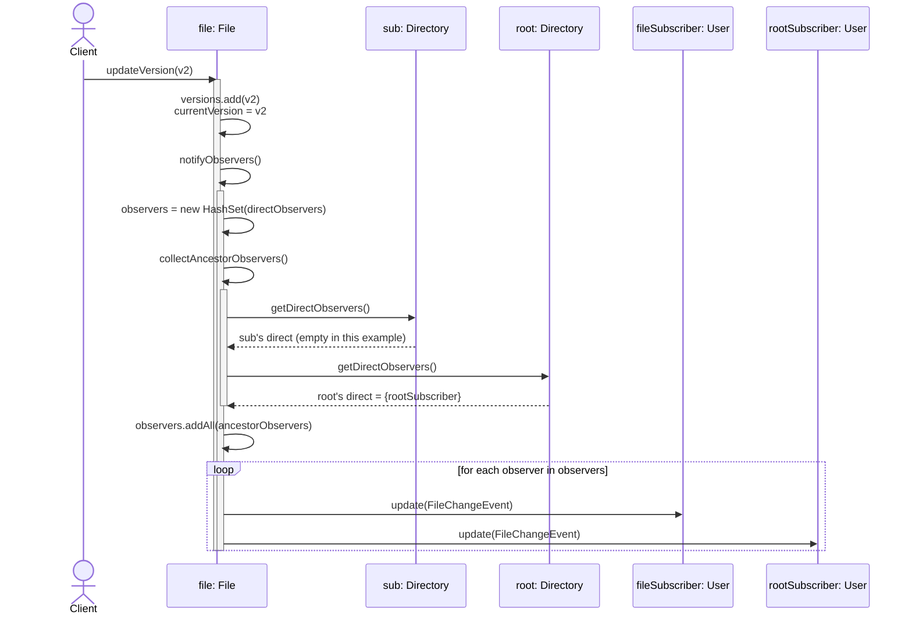
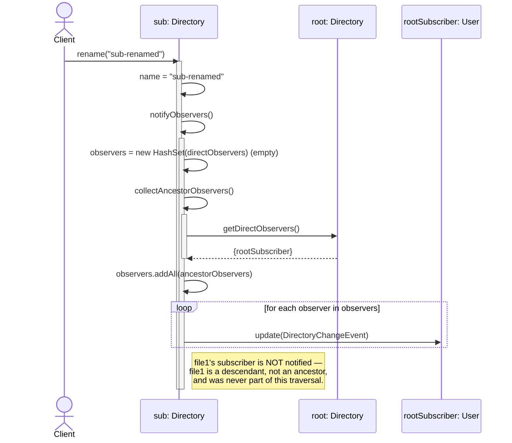
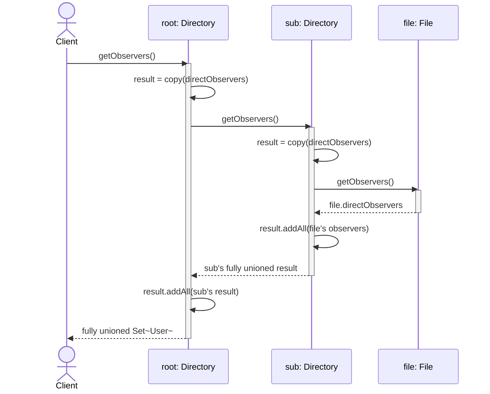

# L10 — Dropbox (Composite + Observer/Sync)

## Overview

File/folder tree using Composite (`FileSystemComponent` / `AbstractFileSystemComponent` / `File` / `Directory`, carried forward from L9), layered with an independent Observer mechanism (`Subject` / `Observer`) for sync notifications. Core new ground this session: **two separate, direction-opposite traversal mechanisms** live on the same tree — a downward recursive query (`getObservers()`) and an upward ancestor-walk used only for change notification (`notifyObservers()` via `collectAncestorObservers()`).

---

## Class Diagram

---

## Sequence Diagrams

### 1. File version update → notify (own direct + ancestor walk)

### 2. Directory rename → notify (own direct + ancestors ONLY, descendants excluded)

### 3. getObservers() — standalone downward query (unrelated to notify)

---

## Key Concepts

- **Composite** (reused from L9): `FileSystemComponent` interface, `AbstractFileSystemComponent` abstract base holding shared structural state (`name`, `parent`), `File` as leaf, `Directory` as composite node holding `List<FileSystemComponent>`.
- **Observer, kept structurally independent of Composite**: `Subject`/`Observer` are separate interfaces, never folded into `FileSystemComponent` via inheritance. Justified via a symlink/shortcut counterexample — a future tree node type might need to be a `FileSystemComponent` without ever needing to be observable, so coupling the two via `extends` would force unwanted behavior onto every future node type (ISP violation).
- **Two distinct, direction-opposite traversal mechanisms on the same tree, deliberately kept separate:**
  - `getObservers()` — **downward** recursive union (a node's own direct subscribers + all descendants' subscribers). Answers: "who is watching this entire subtree?" A pure, standalone query — never invoked as part of the notify path.
  - `collectAncestorObservers()` (in `AbstractFileSystemComponent`, shared helper) — **upward** walk via `getParent()`, collecting only each ancestor's _direct_ subscribers. Answers: "who needs to know about a change originating here?" Used exclusively inside `notifyObservers()`.
- **Notify semantics, asymmetric by design (not a bug):**
  - A **file** change (new version) notifies: the file's own direct subscribers + every ancestor directory's direct subscribers (via upward walk). This correctly reaches someone who subscribed to a whole folder, because the walk passes _through_ that folder as an ancestor.
  - A **directory** change (e.g. rename) notifies: that directory's own direct subscribers + its ancestors' direct subscribers — but **never** descendants. Rationale: subscribing to a directory is an umbrella subscription over its contents (so descendant changes must flow up into it), but subscribing to a file is narrow and content-specific — a file subscriber never expressed interest in their file's containing folder's structural changes, so there's no reason for a directory-level change to flow down into a descendant's subscriber list.
- **`Set<User>` used throughout, not `List`** — guarantees a user subscribed at multiple levels of the same ancestor chain (e.g. both a folder and a file inside it) is notified exactly once per event, not once per matching subscription.
- **`ChangeEvent` polymorphic hierarchy** (`ChangeEvent` abstract, `FileChangeEvent` / `DirectoryChangeEvent`) replaces a considered-and-rejected flat DTO with a nullable `Version` field. Nullability driven by an implicit type distinction (file event vs. directory event) is a design smell; polymorphism is the standard fix.
- **`owner: User` as a plain field on `File`** (plain association, not aggregation/composition — a `File` doesn't structurally "consist of" its owner, it just references one).

---

## Bugs Found + Fixed (this session)

1. **Mutation-through-shared-reference in `File.notifyObservers()`** — initial version called `getObservers()` (which returns the _actual_ `directObservers` field, not a copy) and then called `.addAll()` on that returned reference, silently growing the file's real subscriber set with ancestor observers on every notify call. Fixed by building the notify-set from a **new** `HashSet` seeded with the node's own direct observers, never mutating the field directly.
2. **`Directory.getObservers()` initially omitted the directory's own `directObservers`** from the union — only recursed into children, so a user subscribed directly to a folder (not any file inside it) would never appear in the subtree query. Fixed by adding `result.addAll(getDirectObservers())`.
3. **Uninitialized collections in `Directory`'s constructor** — `directObservers` and `children` were declared but never assigned, which would NPE on first `addObserver()` or `getSize()` call. Fixed by initializing both in the constructor.
4. **`Directory.delete()` — recurrence of the L9 `ConcurrentModificationException` pattern.** Iterating `this.children` directly while each child's own `delete()` call mutates that same list (via `getParent().remove(this)`) throws CME. Fixed with the same snapshot-copy pattern used in L9: iterate over `new ArrayList<>(this.children)` instead of the live list. Self-sourced this fix without a walkthrough this time — direct improvement over L9/L8 where the same bug needed to be pointed out before being fixed.
5. **`Directory.add()` never set the child's parent pointer** — only `remove()` correctly cleared it. Since `collectAncestorObservers()` depends entirely on `getParent()` chains being wired correctly, this bug would have silently broken the entire ancestor-notify mechanism (every ancestor walk would immediately hit `null` and return nothing) without throwing any error — a correctness bug, not a crash, so it would have been easy to miss without deliberately tracing it before running the demo.
6. **`Directory.notifyObservers()` — the most significant bug, took multiple rounds to fully resolve.** Initially called `getObservers()` (the downward recursive query) as its "own contribution" source, which caused a directory-level change (e.g. rename) to also notify subscribers of _descendant files_, an over-notification bug. Verified via `Main.java` demo output before being correctly diagnosed and fixed. Fix: use `getDirectObservers()` (own direct set only, no recursion) inside `notifyObservers()`, keeping the downward query (`getObservers()`) and the notify path (`collectAncestorObservers()` + own direct) fully separate, as originally designed. Notable: the correct design had already been reasoned through and locked earlier in the session (via a symlink-style ISP discussion pattern applied to the notify-direction question), but was second-guessed once the demo surfaced unexpected output, before being re-derived and confirmed correct rather than left as an unresolved assumption.

## Known Deviations

- **None from the locked design.** `Directory.owner` was considered mid-session (matching `File.owner` for "real-world" plausibility) and explicitly walked back — no operation in this case study's scope required it, and it was never wired up (no constructor param / setter existed for it). Intentionally excluded rather than left in as unused dead weight.
