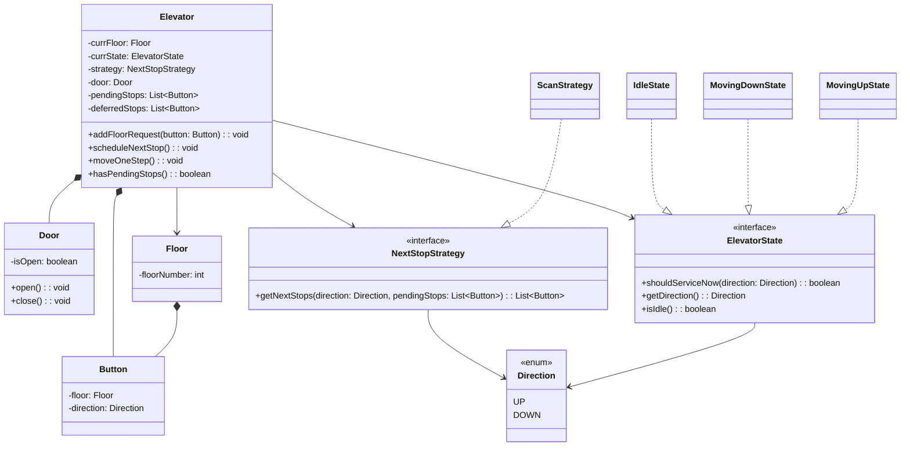
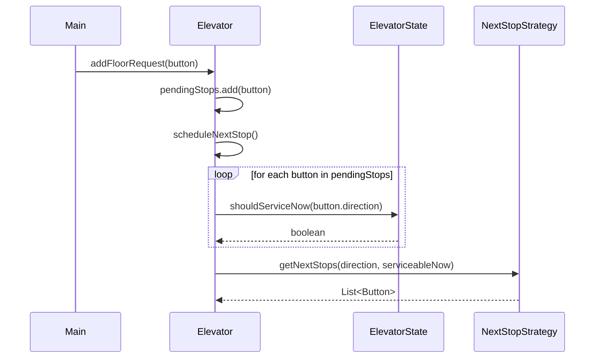
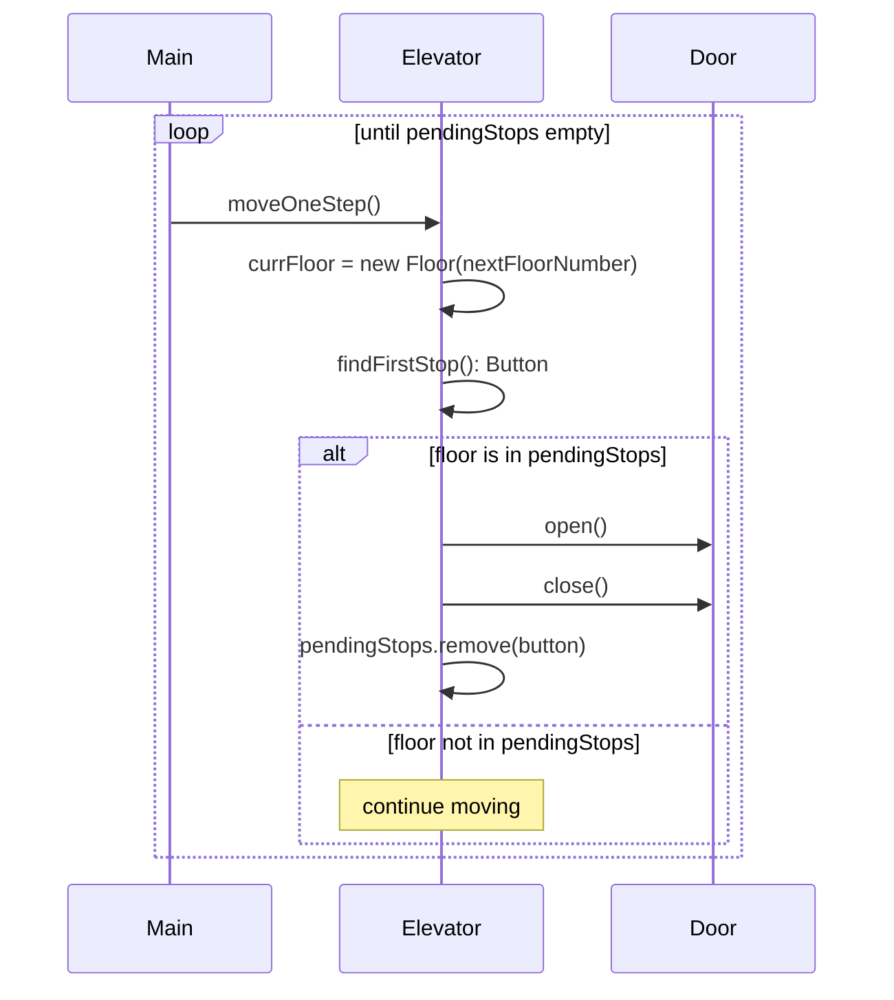

# Elevator System — LLD Notes

## Scope

**In scope:**

- Single elevator, single building
- Floor panel (external) buttons — up/down direction intent
- Internal panel buttons — destination floor, no direction
- Multi-request scheduling (SCAN-like: same-direction nearest-first, opposite-direction deferred)
- Basic move → check stop → open/close door cycle

**Out of scope (explicitly, with reasoning):**

- Overload/weight limit, door obstruction, emergency/alarm — none of these are needed for the basic elevator to function end-to-end, and none serve the State/Strategy pattern learning goals for this exercise. Add only on explicit ask.
- Multi-elevator coordination — a single-lift design already has enough complexity (state + scheduling); dispatch across multiple lifts is a separate, larger problem.
- Damage/power cut — infrastructure-level concerns, not core elevator logic.

**Person** is not modeled as a class — no state/behavior to track. It exists only conceptually; the system's entry point is always `Button` construction + `Elevator.addFloorRequest()`.

---

## Entities

| Entity     | Reasoning                                                                                                                                                                                                                                  |
| ---------- | ------------------------------------------------------------------------------------------------------------------------------------------------------------------------------------------------------------------------------------------ |
| `Elevator` | Core orchestrator — owns floor, state, strategy, door, pending/deferred requests                                                                                                                                                           |
| `Door`     | Composition with Elevator — has no existence or lifecycle outside a specific elevator                                                                                                                                                      |
| `Floor`    | Association with Elevator — floors exist independently of any one elevator, other parts of the building may reference them                                                                                                                 |
| `Button`   | Single class (not Internal/External hierarchy) — behavior is identical; only the data differs (external carries `Direction`, internal only carries a target `Floor`). Composition with Floor — a button has no existence without its floor |

---

## Relationships

- `Elevator *-- Door` — composition (door's lifecycle is bound to its elevator)
- `Elevator *-- Button` — composition (internal buttons only exist as part of the elevator)
- `Floor *-- Button` — composition (external buttons only exist as part of their floor)
- `Elevator --> Floor` — association (elevator references its current floor; floors persist independently)

---

## Patterns Used

### State — `Idle`, `MovingUp`, `MovingDown`

**Why:** Behavior genuinely differs per state when handling a new request — not just a label difference. Example: lift moving up 4→8, a request for floor 6 (same direction, in-path) is serviced immediately; a request for floor 2 (opposite direction) is deferred until the current sweep completes. This decision logic is exactly what `ElevatorState.shouldServiceNow(Direction)` encodes per concrete state.

### Strategy — `NextStopStrategy` / `ScanStrategy`

**Why:** A real, swappable algorithmic choice exists (SCAN vs FCFS vs LOOK) for deciding _order_ among already-filtered candidate stops. Justification required more than "elevators use it" — the actual test applied was: do genuine alternative algorithms exist, not just alternative inputs to the same algorithm. Note: elevator _direction_ (Idle/Up/Down) is **not** a Strategy variant — that's State's job (filtering). Strategy only orders what State has already deemed serviceable.

---

## Key Design Decisions

1. **Filtering (State) vs Ordering (Strategy) — separated responsibilities.** `Elevator.scheduleNextStop()` first partitions `pendingStops` into serviceable-now / deferred using `currState.shouldServiceNow()`, then passes only the serviceable list to `strategy.getNextStops()` for ordering. Keeps Strategy implementations swappable without needing to know state-filtering rules.

2. **`moveOneStep()` as a primitive, not a looping `moveToFloor()`.** Since this is a single-threaded, `main()`-driven simulation (no concurrency in scope), movement had to be exposed one floor at a time so `main()` retains control between floors — this is what allows mid-route request injection to be demonstrated at all. A method that looped to completion internally would never let `main()` interleave a new `addFloorRequest()` call.

3. **Deferred requests are accumulated, not overwritten.** `scheduleNextStop()` appends newly-deferred buttons into `deferredStops` (`addAll`) rather than reassigning the field — an earlier bug overwrote previously-deferred requests every time the method ran again, silently losing them.

4. **`null` direction on `Button` represents an internal press.** `shouldServiceNow()` treats `null` as always-serviceable (`direction == null || direction == <state's direction>`) — an internal press has no direction preference of its own; it's implicitly "whichever way the elevator is already going."

5. **Idle same-floor request edge case.** If the nearest request while idle is the elevator's current floor, state stays `Idle` (no direction to assign) and `moveOneStep()` simply performs the stop-check at the current floor without moving — avoided via `isIdle()` rather than inferring idleness from `getDirection() == null` (an earlier design used the null-check directly, which was fragile and caused a floor-teleport bug).

6. **State-identity checks use `isIdle()`, not `getDirection() == null`.** Reverse-engineering "am I idle" from a nullable field was flagged as a code smell — added `isIdle(): boolean` to the `ElevatorState` interface so identity is asked directly.

---

## Class Diagram

---

## Sequence Diagram — New Floor Request Added

---

## Sequence Diagram — Move / Stop Flow

---

## Bugs Found & Fixed During Development

- **Inverted `hasPendingStops()`** — returned `isEmpty()` instead of `!isEmpty()`, would have broken every driver loop.
- **Floor-teleport bug** — `moveOneStep()` initialized `nextFloorNumber` to `0` instead of current floor when idle, silently resetting elevator position.
- **Starvation risk** — early design would have removed (not deferred) opposite-direction requests during filtering; fixed to hold them in `deferredStops` and re-merge on next idle transition.
- **Deferred-list overwrite** — `scheduleNextStop()` reassigned `deferredStops` instead of accumulating into it, silently losing previously-deferred requests across multiple calls.
- **Null-direction filtering trap** — internal button presses (no direction) were being deferred forever once the elevator started moving, since `shouldServiceNow(null)` returned `false`. Fixed by treating `null` as always-serviceable.
- **Inverted movement condition** — `moveOneStep()` briefly computed next floor only `if (currState.isIdle())`, backwards from the intended `if (!isIdle())`.
