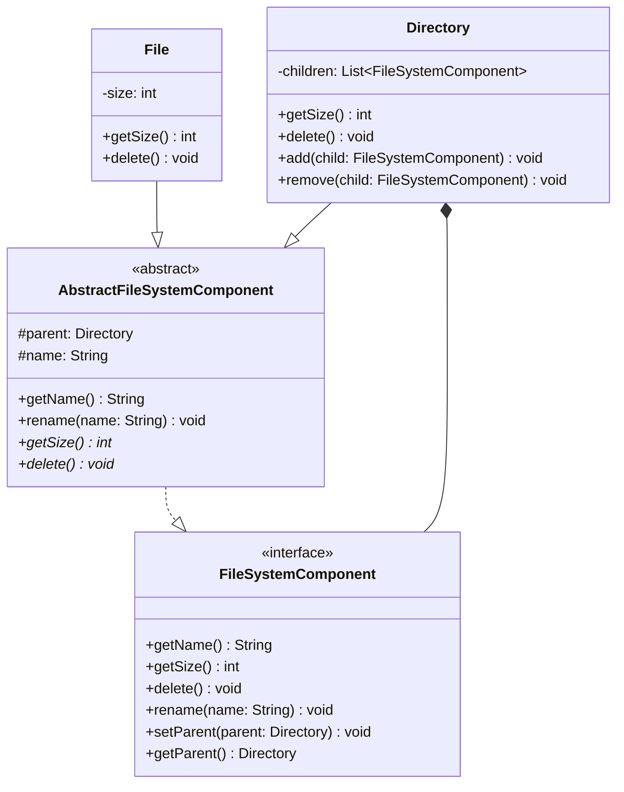
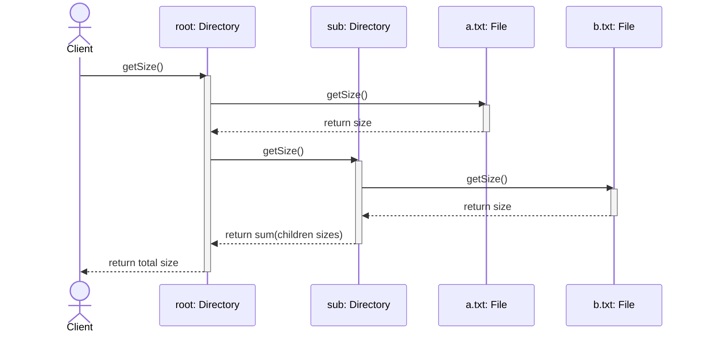
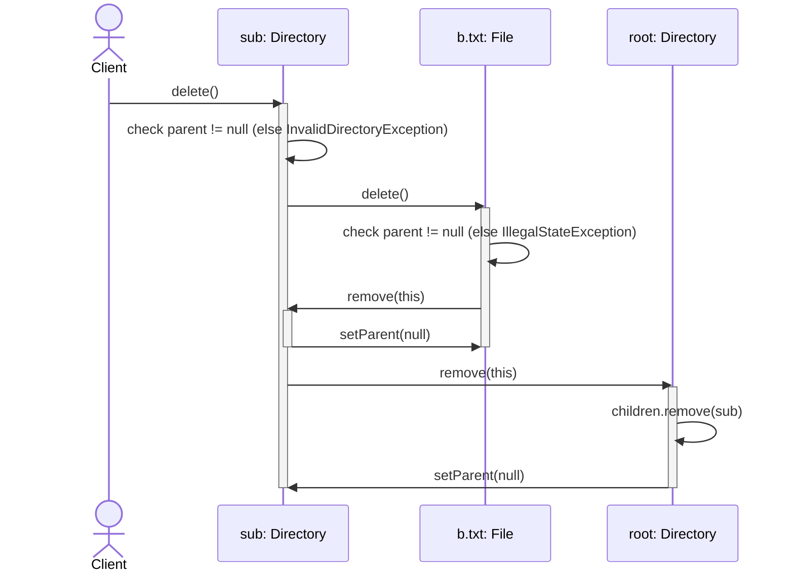

# L9 — File System (Composite Pattern)

## Overview

Models a file system tree where `File` (leaf) and `Directory` (composite) are treated
uniformly through a common `FileSystemComponent` interface — classic Composite pattern.

## Class Diagram

## Sequence Diagram — getSize() (Recursive Traversal)

## Sequence Diagram — delete() (Cascading Deletion)

## Key Concepts

- **Composite pattern**: `File` (leaf) and `Directory` (composite) both implement
  `FileSystemComponent`, letting clients call `getSize()`/`delete()` uniformly without
  caring which concrete type they're holding. Polymorphic dispatch handles the recursion
  base case naturally — no `isLeaf()`/type-check needed anywhere in the design.
- **Abstract class for shared state**: `AbstractFileSystemComponent` holds `name`/`parent`
  and their concrete accessors, so `File`/`Directory` don't duplicate that plumbing.
  `getSize()`/`delete()` are declared `abstract` there — no default bodies — forcing every
  concrete subclass to supply its own implementation (compile-time enforcement over
  silent runtime fallback).
- **Parent-pointer invariant, enforced via two distinct exception types**:
  - `InvalidDirectoryException` — thrown when `delete()` is called on a `Directory` with
    no parent (the root). This is a **disallowed-by-design** case, not a bug — root is
    expected to legitimately have no parent.
  - `IllegalStateException` — thrown when `delete()` is called on a `File` with no parent.
    Unlike root, a parentless `File` is **never a legitimate state** through normal API
    usage (`File`s only exist meaningfully once `add()`ed to a `Directory`), so hitting
    this indicates an invariant violation elsewhere, not a designed case.
- **Single source of truth for parent/child sync**: `Directory.add()`/`remove()` are the
  only places that mutate `children` and the child's `parent` reference — always together,
  in one method, so the two can't drift out of sync. `File.delete()` and `Directory.delete()`
  both delegate through `getParent().remove(this)` rather than partially updating state
  themselves.

## Bugs Found + Fixed (this session)

1. **Field shadowing** — `name`/`size` were initially redeclared in `File`/`Directory`
   even though `name` already lived in `AbstractFileSystemComponent`, silently creating
   hidden duplicate fields instead of using the inherited one.
2. **Non-abstract "abstract" class** — `AbstractFileSystemComponent` initially had concrete
   dummy bodies (`return 0;`, no-op) for `getSize()`/`delete()` instead of being declared
   `abstract`. Would have allowed a future subclass to silently inherit wrong behavior
   instead of getting a compile error for a missing implementation.
3. **`File.delete()` incomplete** — initially only nulled its own `parent` reference
   without removing itself from the parent's `children` list, leaving a stale/phantom
   entry that would still be counted by `getSize()` and returned by traversal.
4. **Interface/type mismatch** — `setParent()`/`getParent()` existed only on
   `AbstractFileSystemComponent`, not on `FileSystemComponent`. Since `Directory.children`
   and `remove()`'s parameter are typed as the interface, calling `setParent()` on a
   `FileSystemComponent`-typed variable failed to compile. Fixed by promoting both methods
   onto the interface, preserving the interface's role as the full common contract.
5. **`Directory.delete()` — three compounding bugs**:
   - Root guard checked the wrong object (`child.getParent()` inside the loop, which is
     never null since children are always `add()`ed) instead of `this.getParent()`.
   - Missing self-removal from its own parent (`setParent(null)` alone leaves it in the
     parent's `children` list).
   - `ConcurrentModificationException` risk from mutating `this.children` (via nested
     `remove()` calls triggered by each `child.delete()`) while iterating that same live
     list with an enhanced for-loop. Fixed by iterating a snapshot copy
     (`new ArrayList<>(this.children)`) instead.

## Known Deviations from Standard Solution

None. Design follows the standard Composite-pattern solution for File System:
interface + abstract base + leaf/composite concrete classes, parent-pointer-based
deletion, composition relationship between `Directory` and `FileSystemComponent`.

## Verification

`Main.java` — 5 scenarios, all passing:

1. `getSize()` recursive sum across nested directories
2. `delete()` on a non-root `File` — confirms removal from parent's children + size update
3. `delete()` on a non-root `Directory` — confirms cascading deletion of children + removal from parent
4. `delete()` on root — confirms `InvalidDirectoryException`
5. `delete()` on a constructed-but-never-added `File` — confirms `IllegalStateException`
   (note: not reachable through normal API usage; exists purely as a defensive guard
   against an invariant violation caused by a bug elsewhere)
