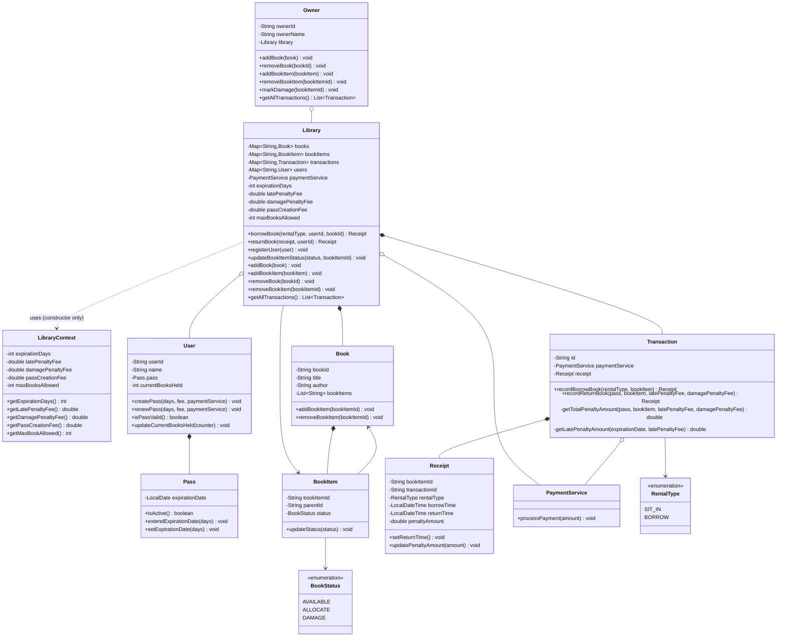
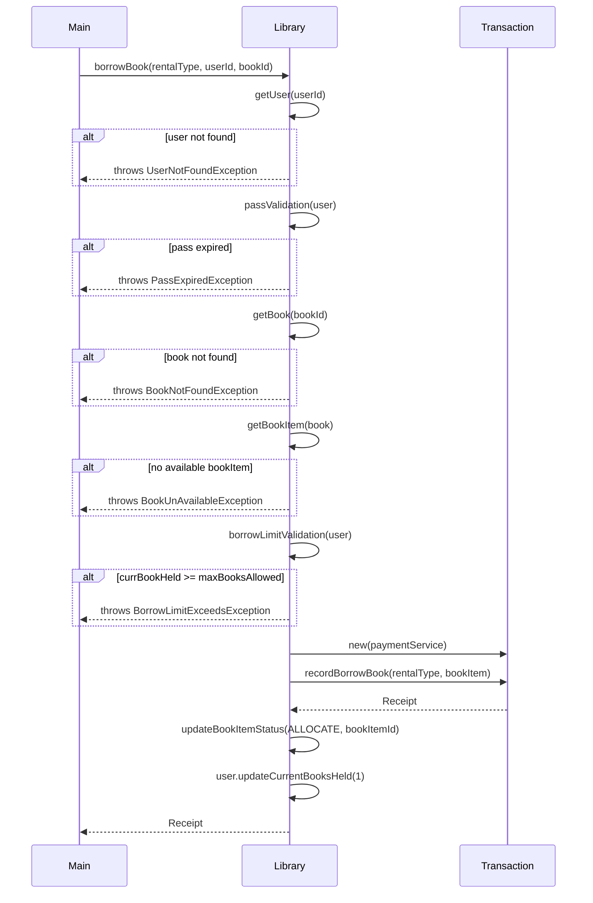
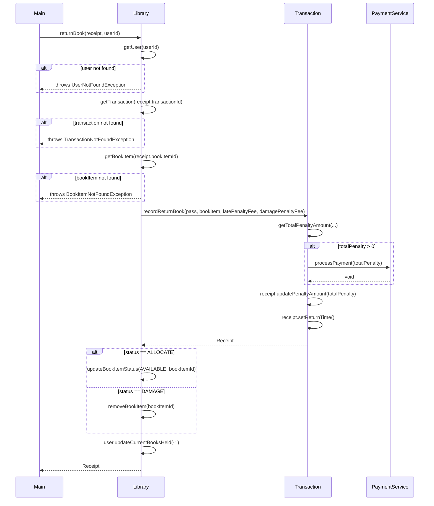

# Library Management System — LLD Notes

## Scope

**In scope:**

- Single library, single owner. Owner adds/removes books (by title) and copies (individually), and views all transaction history.
- Users borrow via direct ID lookup only (no title/author search).
- Two rental types on one `Transaction`/`Receipt` shape: `SIT_IN`, `BORROW`. Both require an active `Pass` and both count against a user's `maxBooksAllowed` cap. Both affect `BookItem` availability identically.
- Borrowing requires an active 30-day `Pass` (configurable), purchased/renewed for a flat fee via a stub `PaymentService`.
- No time-based rental fee. Penalty only on: (a) late return — pass expired before return, `BORROW` only, per-day flat rate; (b) damage — flat fee, applies to both rental types, owner-determined.
- Damaged `BookItem`s are discarded entirely (removed from circulation and from the catalog); parent `Book` persists with zero copies if it was the last one.
- Book/BookItem split: `Book` is catalog metadata (title, author) owning a list of copy IDs; `BookItem` is a per-copy object with its own status (`AVAILABLE`/`ALLOCATE`/`DAMAGE`).

**Out of scope (explicit):**

- Search by title/author (ID lookup only)
- Reservation/waitlist system
- Real payment processing (stub only)
- Per-copy condition/damage _history_ (status only, no log)
- Multiple libraries/branches, multiple owners
- Late fees beyond the flat per-day rate (no separate "overdue" concept)
- Declared expected-return-time at borrow (simplified: lateness is just "was the pass still active at return time")

## Entities

| Class            | Role                                                                                                             |
| ---------------- | ---------------------------------------------------------------------------------------------------------------- |
| `Library`        | Central aggregator — catalog maps, transaction history, user registry, policy config, orchestrates borrow/return |
| `LibraryContext` | Builder-constructed config bundle passed into `Library`'s constructor (not stored)                               |
| `Owner`          | Actor — adds/removes books and copies, marks damage, views transactions                                          |
| `User`           | Name, `Pass`, running count of books currently held, cap                                                         |
| `Pass`           | 30-day validity window, `isActive()` query                                                                       |
| `Book`           | Catalog metadata (title, author) + list of its copy IDs                                                          |
| `BookItem`       | Individual physical copy — own ID, status, back-ref to parent `Book`                                             |
| `Transaction`    | Does the work — records borrow/return, calculates penalty, triggers payment                                      |
| `Receipt`        | DTO returned to the user — safe, narrow view of a transaction (no `PaymentService` exposure)                     |
| `PaymentService` | Stateless stub — `processPayment(amount)`                                                                        |

## Patterns Used, and Why

**Deliberately zero behavioral/structural patterns from the original Tier list (Iterator, Observer, Builder-on-domain-objects, State, Strategy).** Each was tested against a concrete criterion and rejected:

- **State** — `BookStatus` is a plain enum flag `Library` checks/sets. No object's _behavior_ changes based on status (no polymorphic dispatch). Correctly modeled as a plain field.
- **Strategy** — damage and late penalties are always summed together (`totalPenalty = damage + late`), never swapped/selected. No real "pick one implementation" scenario.
- **Observer** — no notification requirement exists anywhere in scope (reservations/alerts explicitly out of scope). Nothing to observe.
- **Iterator** — finding an available copy is a plain filtered loop over a `List`. Built-in Java iteration fully covers it; no custom traversal logic needed.
- **Builder (on `Receipt`)** — considered and rejected. `Receipt`'s 6 fields split cleanly into two always-together groups (borrow-time, return-time) — a two-phase constructor+update-method models this more directly than a builder. Builder solves _combinatorial optional fields_, which this isn't.

**One pattern genuinely used: Builder, on `LibraryContext`.** `Library`'s construction needs 5 policy values (`expirationDays`, `latePenaltyFee`, `damagePenaltyFee`, `passCreationFee`, `maxBooksAllowed`) — a real case of a constructor with enough parameters that a builder improves readability/safety at the call site. This is the pattern that actually earned its place through the same test that rejected the others.

**Lesson:** a pattern belongs when a concrete test is satisfied (real polymorphic dispatch, a real notify-on-event need, real combinatorial-optional-field construction) — not because a case study "should" have one. A clean, pattern-light POJO-and-service design is a correct outcome when requirements are genuinely simple in that dimension, not a missed opportunity.

## Key Design Decisions

- **Book/BookItem split** (standard shape, not count-only) — chosen deliberately after evaluating the count-only alternative, to preserve per-copy identity/status tracking (needed for damage).
- **`Transaction` vs `Receipt` split is real, not redundant** — `Transaction` holds `PaymentService` and does the work (fee calc, triggers payment); `Receipt` is a deliberately _narrower_ DTO returned outward, hiding internal machinery (payment access) from the caller. Justified by encapsulation, not just habit.
- **Stored field vs. transient parameter, decided by ownership + persistence-across-calls:** `PaymentService` — stateless, shared, needed repeatedly → stored (aggregation) on both `Transaction` and threaded as a parameter into `User`'s pass methods. `Pass` — owned by `User`, only needed transiently inside `Transaction`'s one calculation → parameter, never stored on `Transaction`.
- **ID-based lookup pattern used consistently**: `Library` maps everything by ID (`bookId`, `bookItemId`, `transactionId`, `userId`) rather than passing/matching whole objects — mirrors the `Map`-based O(1) lookup already used for books, extended to transactions once the earlier `List<Transaction>` + object-reference matching was identified as fragile.
- **Late-penalty rule simplified mid-design**: originally "declare expected return time upfront, compare at return" (mirroring L4's hourly-estimate idea); simplified to "was the pass still active at return time" — same spirit as an earlier collapse decision in L4 (removing an object/field that wasn't earning its complexity).
- **`SIT_IN` and `BORROW` behave identically except for one branch**: both consume a borrow-slot, both make the `BookItem` unavailable, both can incur damage penalty — only late-penalty is skipped for `SIT_IN` (no location for a "sit-in" session to become "late" in this scope).
- **Pass renewal**: if still active, extends from current expiry (`currentExpiry + validityDays`); if expired, resets fresh from today (`now + validityDays`).

## Design Smells Caught During Review

- **Two composition owners for one object** — `Library` initially composed `BookItem` directly, conflicting with `Book`'s true ownership. Corrected to `Library --> BookItem` (association/index only), `Book *-- BookItem` (true ownership).
- **Backward control flow** — an early draft had `Library.return()` internally calling `Owner.markDamage()`, i.e., a service class calling back into the actor that drives it. Corrected: `Owner.markDamage()` is called by the actor _before_ `return()`, and `Library`/`Transaction` only ever _read_ the already-set status.
- **Unjustified duplicate object** — a `Session` (analogous to L4) was considered for the pass-gated borrow window and correctly rejected; borrow-time data lives directly on `Transaction`/`Receipt`, no separate session object.
- **Circular back-reference with no read path** — `Pass.user` was added, then removed once no flow was found that ever called `pass.getUser()`.
- **PaymentService reachability** — initially reachable only via `Transaction`; corrected to originate as a single instance on `Library`, threaded outward through whoever already holds a `Library` reference (`Owner` → passed as a parameter into `User`'s pass methods), rather than each class independently constructing its own.

## Bugs Found + Fixed (code stage)

1. `RentalType.STI_IN` → typo, fixed to `SIT_IN`.
2. `BookItem` had no status setter — added `updateStatus()`.
3. `Book` had no way to add copies post-construction — added `addBookItem()`/`removeBookItem()`.
4. `Pass.extendExpirationDate()` discarded the result of `LocalDate.plusDays()` (immutable type, non-mutating call) — fixed to reassign.
5. `Library`'s maps were never initialized in the constructor — NPE on first write. Fixed.
6. `LibraryContext.Builder` was package-private — invisible to `Main` in a different package. Fixed to `public static class`.
7. `LibraryContext.Builder.setLatePenaltyFee()` assigned the wrong field (`expirationDays` instead of `fee`) — copy-paste bug, fixed.
8. `borrowBook` updated `BookItem` status using the wrong ID (`bookId` instead of `bookItem.getBookItemId()`) — fixed.
9. `returnBook`'s private `getBookItem(String)` lookup incorrectly required `AVAILABLE` status, which rejected every legitimate return (a returned item is `ALLOCATE`, not `AVAILABLE`) — status check removed from this lookup entirely; status handling moved to the caller, where it belongs.
10. `removeBookItem` only removed from `Library`'s map, never from the parent `Book`'s list — drifted out of sync with `addBookItem`'s symmetric behavior. Fixed to remove from both.
11. `User.currentBooksHeld` was never actually updated by `borrowBook`/`returnBook`, silently disabling the borrow cap entirely (`0 >= maxBooksAllowed` never true). Fixed — `updateCurrentBooksHeld(±1)` added to both flows.
12. `Transaction.recordReturnBook` calculated the penalty but never called `PaymentService.processPayment()` — penalties were computed and stored but never actually "collected." Fixed to call payment conditionally (`if totalPenalty > 0`).
13. `List.of(...)` used for `Book`'s initial copy list in `Main` — immutable, threw `UnsupportedOperationException` on the first `addBookItem`. Fixed to use a mutable list, and resolved the deeper duplicate-ID risk by always constructing `Book` with an empty list and adding every copy — including the first — exclusively through `Owner.addBookItem()`.
14. Early `getLatePenaltyAmount` had `ChronoUnit.DAYS.between()` arguments reversed, producing a negative days-late count. Fixed to `between(expirationDate, now)`.
15. Hardcoded penalty magic numbers (`days * 5.0`, `100.00`) inside `Transaction`, contradicting the design's "policy values live on `Library`" decision — fixed to accept `latePenaltyFee`/`damagePenaltyFee` as parameters.
16. Missing `SIT_IN` gate on late-penalty calculation — an expired pass on a `SIT_IN` transaction was incorrectly charged a late fee. Fixed to gate on `rentalType == BORROW`.

## Known Deviations from Original Diagrams

- All entity IDs implemented as `String`, not `int` as originally sketched on the class diagram.
- `Transaction` self-generates its `id` via `UUID.randomUUID()` inside its own constructor, rather than `Library` generating and passing an ID into `new Transaction(transactionId)` as the sequence diagram originally showed.
- No separate `damagePenaltyCalc()` method — damage fee is a flat add inlined directly into `getTotalPenaltyAmount()`, since it involves no real calculation (unlike late-penalty, which does day-math).
- `latePenaltyFee`/`damagePenaltyFee` are passed into `Transaction.recordReturnBook(...)` as parameters rather than being fields Transaction reads from a stored `Library`/policy reference.
- Exception set expanded/renamed from the original six: added `BookNotFoundException` (title not found) as distinct from `BookUnAvailableException` (title exists, no free copy) and `BookItemNotFoundException` (specific copy ID not found on return). Final set: `UserNotFoundException`, `PassExpiredException`, `BookNotFoundException`, `BookUnAvailableException`, `BookItemNotFoundException`, `BorrowLimitExceedsException`, `TransactionNotFoundException`.
- `Owner` gained `addBookItem`/`removeBookItem` (per-copy operations), beyond the original title-level-only method list — confirmed as an intentional scope addition, not scope creep.
- Damaged `BookItem`s are fully removed (from `Library`'s map and from the parent `Book`'s copy list) rather than merely flagged and retained — a deliberate scope decision made during coding, not in the original design discussion.
- `Builder` pattern introduced for `Library`'s construction via `LibraryContext` — not part of the original pattern-free design intent, earned its place through the parameter-count test during coding.

## Class Diagram

See `uml/library-class-diagram.puml` for the full PlantUML version. Mermaid version below, synced to final code:

## Sequence Diagrams

See `uml/library-sequence-borrow.puml` and `uml/library-sequence-return.puml` — both fully synced to final code (method names, exception types, parameter lists).

## Conceptual Q&A at Sign-off

1. **Field vs. parameter rule** — a dependency is a stored field when it's stateless/shared and needed repeatedly (`PaymentService`); it's a transient parameter when it's owned by another class and only needed briefly within one calculation (`Pass`, owned by `User`, used only inside `Transaction`'s penalty math). Ownership + call-scope, not mutability, is the deciding factor.
2. **Pattern-fit test** — concrete criteria, not case-study expectation: does behavior genuinely differ per branch with real polymorphic dispatch (State/Strategy); is there a real notify-on-event need (Observer); does an object have enough independently-combinable optional fields that a plain constructor is error-prone (Builder). If none apply, no pattern is the correct answer.
3. **Diagram-stage gap** — a status-based bug (`getBookItem` wrongly requiring `AVAILABLE` on return) slipped through the sequence diagram review because diagrams were checked for message flow and parameter correctness, not for tracing an object's _actual state_ at each call site. Habit to carry forward: trace one concrete object through its full status lifecycle at the diagram stage (what state is it in _when this specific call happens_), the same discipline already applied to return values.
