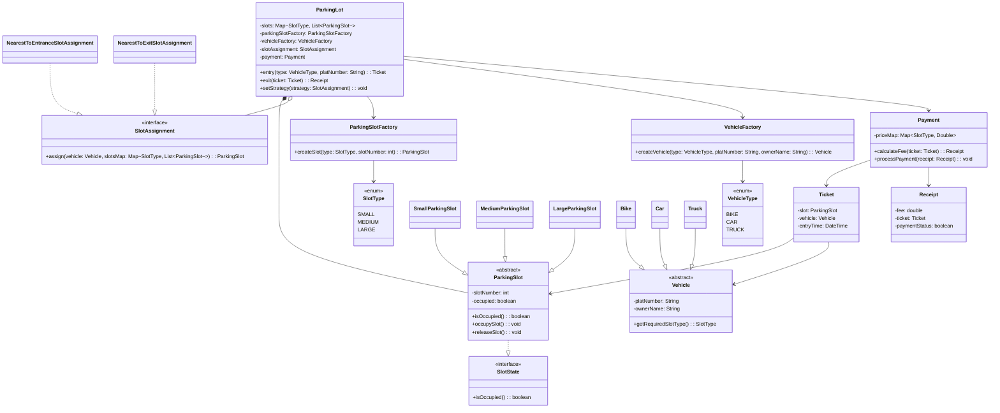
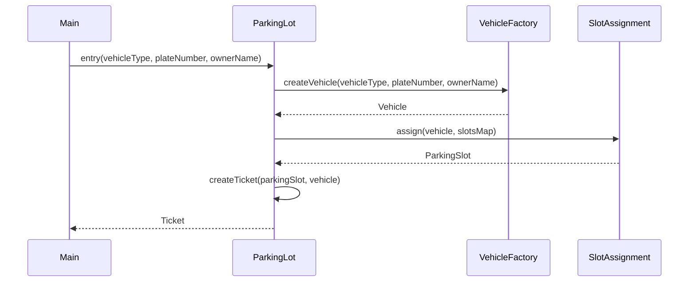
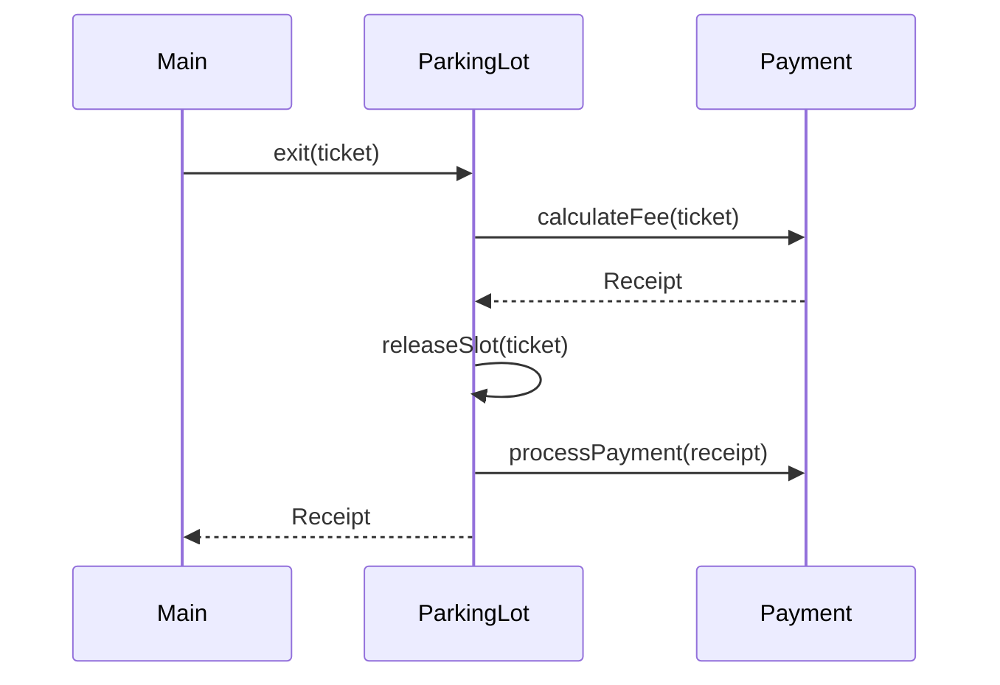

# L1 — Parking Lot System

## Problem Scope

A parking lot system that handles vehicle entry and exit, slot allocation by vehicle type,
fee calculation on exit, and slot release after payment.

**In scope:** entry/exit flow, slot allocation, fee calculation, payment, receipt  
**Out of scope:** payment gateways, discounts, adding/removing slots at runtime

---

## Core Use Cases

1. Vehicle entry — allocate slot, generate ticket
2. Slot allocation — match vehicle type to slot type
3. Fee calculation — based on duration and slot type
4. Vehicle exit — calculate fee, take payment, release slot
5. Availability tracking — always know which slots are free by type

---

## Entities

| Entity                 | Role                                                |
| ---------------------- | --------------------------------------------------- |
| ParkingLot             | Orchestrator — owns all slots, handles entry/exit   |
| ParkingSlot            | Individual slot — has type and occupied state       |
| Vehicle                | Data carrier — plate number, vehicle type           |
| Ticket                 | Entry record — holds slot, vehicle, entry time      |
| Payment                | Calculates fee from ticket, returns Receipt         |
| Receipt                | Exit record — fee, ticket reference, payment status |
| SlotAssignmentStrategy | Algorithm for finding best available slot           |
| ParkingSlotFactory     | Creates correct slot subclass from type string      |
| VehicleFactory         | Creates correct vehicle subclass from type string   |

---

## Patterns Used

### Strategy — Slot Assignment

**Why:** The algorithm for finding the best slot is swappable at runtime.
Tomorrow the business may want nearest-to-elevator instead of nearest-to-entrance.
Each algorithm gets its own class — no touching existing code when adding new ones. OCP preserved.

**Where:** `SlotAssignment` interface, `NearestToEntranceStrategy`, `NearestToExitStrategy`

**Context:** `ParkingLot` holds the strategy via aggregation and calls `assign(vehicle)` at entry.

### State — Slot Occupancy

**Why:** A ParkingSlot behaves differently based on whether it is free or occupied.
Same object, different behavior based on state.

**Where:** `SlotState` interface with `isOccupied(): boolean`, implemented by `ParkingSlot`

### Factory — Vehicle and Slot Creation

**Why:** Caller should not need to know which concrete class to instantiate.
VehicleFactory takes a type string and returns the right Vehicle subclass.
ParkingSlotFactory does the same for slots. Creation logic is centralized.

**Where:** `VehicleFactory.createVehicle(type)`, `ParkingSlotFactory.createSlot(type)`

---

## Class Diagram

---

## Sequence Diagram — Entry Flow

---

## Sequence Diagram — Exit Flow

---

## Key Design Decisions

- `ParkingLot` uses `Map<SlotType, List<ParkingSlot>>` — initialized at startup for O(1) slot lookup by type
- `Ticket` holds object references to `ParkingSlot` and `Vehicle` — not just IDs
- `SlotAssignment` is aggregated by `ParkingLot` — strategy is independent, reusable, swappable
- `Payment` returns `Receipt` — not just a double — receipt carries fee + ticket + status
- `releaseSlot()` called after payment — never free a slot before payment succeeds
- Factories called by `ParkingLot`, not `Main` — creation is an implementation detail
- Vehicle and ParkingSlot are abstract classes, not interfaces — they carry shared fields
- addSlot() / removeSlot() — admin/operational concern, separate from transactional flow
- Global slot numbering (1, 2, 3... across all types, not restarted per type) — required for `NearestToEntrance`/`NearestToExit` strategies to compare slot numbers meaningfully
- `Payment`, `ParkingSlotFactory`, `VehicleFactory` created internally by `ParkingLot` (not injected) — single implementation each, no abstraction to depend on; DIP not violated meaningfully here
- `SlotAssignment` has a default strategy (`NearestToEntranceSlotAssignment`) set in constructor — `setStrategy()` allows runtime swap, no null-check needed at call site
- `entry()` returns `null` on no-slot-available (caught `IllegalStateException`) — `Main` must null-check before calling `exit()`
- `Vehicle.getRequiredSlotType()` used by `Payment` to determine rate — relies on invariant that assigned slot type always equals vehicle's required type (true in this system, no overflow parking)

## `// WHY:` Comments in Code

- `Payment.calculateFee()` — `Math.max(1, hours)`: minimum 1-hour billing, even if actual duration is under an hour
- `NearestToEntranceSlotAssignment.assign()` — lower `slotNumber` = closer to entrance (assumed linear layout)
- `NearestToExitSlotAssignment.assign()` — higher `slotNumber` = closer to exit (assumed linear layout)
