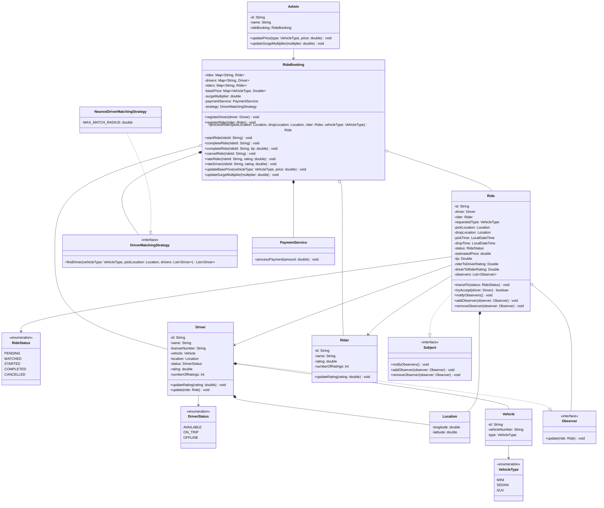
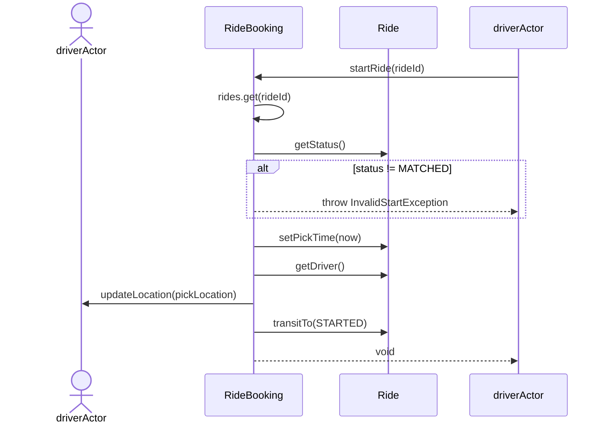
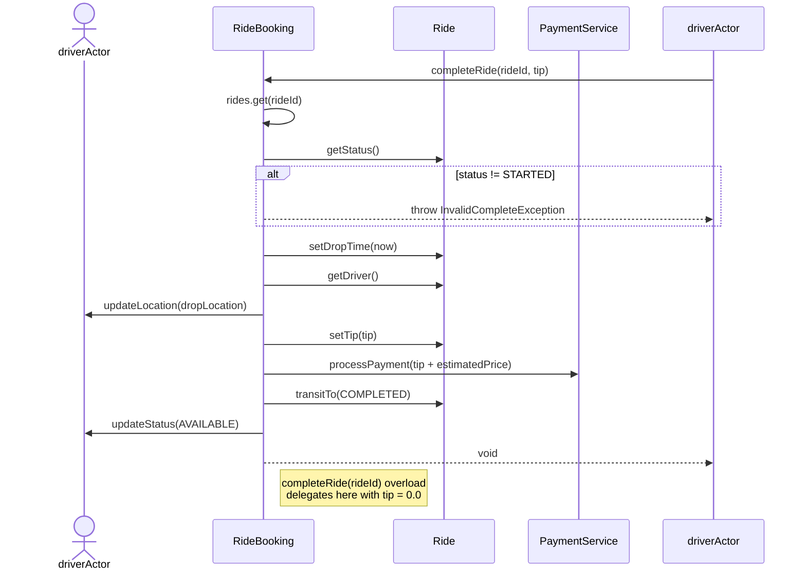
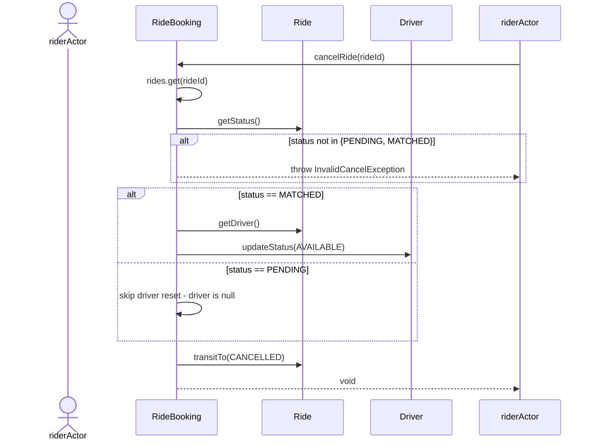

# L8 — Ride Sharing (Ola/Uber-style) — LLD Case Study

## Overview

A ride-hailing system supporting rider/driver registration, ride type selection (MINI/SEDAN/SUV), broadcast-based driver matching with accept/reject, ride lifecycle management, fare estimation with admin-configurable base pricing and surge multiplier, tipping, bidirectional rating, and a stubbed payment step.

**Patterns used:** Strategy (driver eligibility filtering), Observer (ride-offer broadcast to candidate drivers).
**Deliberately not used:** State pattern for ride status, a Strategy for pricing, a lock/timeout mechanism. See _Known Deviations_ for reasoning.

---

## Class Diagram

---

## Sequence Diagrams

### startRide

### completeRide

### cancelRide

_(rateDriver/rateRider have no dedicated sequence diagram — flow is a single guarded field update, judged too simple to warrant one.)_

---

## Key Concepts

- **Driver as a single entity, no static/dynamic split.** Unlike `Seat`/`ShowSeat` in L7, `Driver` has no cardinality reason to split — a driver has exactly one current location/status at any instant, no simultaneous per-context state. The lesson from L7 wasn't "always split static vs dynamic," it was "split when cardinality demands it."
- **No lock/timeout mechanism.** Concurrency-safety was deliberately scoped out for the base design (single-threaded, synchronous matching) and only reintroduced later for the broadcast/accept-reject extension — and even then, a `synchronized` check-and-set method on `Ride` was sufficient; no lock object, no timeout needed, since the decision window is short-lived and scoped to one object.
- **VehicleType pricing is mutable, admin-owned config**, not baked into the enum — lives as `Map<VehicleType, Double>` on `RideBooking`, single source of truth, admin mutates via `updatePrice`.
- **Surge is a parameter, not a Strategy.** `NormalPricing` and `SurgePricing` would have been identical formulas differing only by one multiplied value — correctly identified as not warranting a Strategy interface.
- **RideStatus is a plain enum**, not a State pattern — transition legality checked via a simple guard per method; no per-state behavior divergence beyond legality checks, so State pattern would have been unjustified complexity.
- **Broadcast matching + Observer.** Initial design used deterministic nearest-driver assignment. Mid-session, this was identified as not representing real ride-sharing (driver must choose, not be assigned). This reintroduced Observer — correctly, this time — because the set of interested parties (all eligible drivers in range) is genuinely one-to-many and unknown in advance, unlike the ride's one-to-one relationship with its single rider/driver.
- **Atomic check-and-set for race resolution.** `Ride.tryAccept(Driver)` is `synchronized`, checking `status == PENDING` and setting `status = MATCHED` in one atomic block. This is what actually prevents double-assignment when multiple drivers' threads call `tryAccept` concurrently — proven via an `ExecutorService`-based test in `Main`.
- **Rating as a running average**, stored via `(count, average)` pair, not a naive `(old + new) / 2` (which converges toward recent values rather than computing a true mean).
- **ID-resolution ownership**: `RideBooking` resolves rider/driver IDs into objects; services and strategies work with resolved objects only.

---

## Bugs Found + Fixed

| Bug                                                                                                                                                                                                                                                   | Where                              | Fix                                                                                                                                       |
| ----------------------------------------------------------------------------------------------------------------------------------------------------------------------------------------------------------------------------------------------------- | ---------------------------------- | ----------------------------------------------------------------------------------------------------------------------------------------- |
| Naive rating formula `(old+new)/2` doesn't compute a true average                                                                                                                                                                                     | `Driver`/`Rider`                   | Track `numberOfRatings`, compute `(count*old + new) / (count+1)`                                                                          |
| `cancelRide` only allowed `PENDING`, contradicting agreed rule (cancel allowed pre-pickup, i.e. PENDING or MATCHED)                                                                                                                                   | `RideBooking.cancelRide`           | Guard updated to allow both; driver-reset made conditional to avoid NPE on null driver in PENDING case                                    |
| Collapsed exception types (`InvalidStatusException` reused everywhere) instead of the agreed separate exceptions                                                                                                                                      | `RideBooking` + exceptions package | Split into `InvalidCancelException`, `InvalidStartException`, `InvalidCompleteException`, `InvalidRatingException`                        |
| `rateDriver`/`rateRider` had no status guard — could rate a PENDING or CANCELLED ride                                                                                                                                                                 | `RideBooking`                      | Added `status == COMPLETED` guard, throwing `InvalidRatingException`                                                                      |
| `surgeMultiplier` field existed but was never read in price calculation                                                                                                                                                                               | `RideBooking.getPrice`             | Multiplied into the formula                                                                                                               |
| `NoDriverAvailableException` constructed but never thrown (missing `throw` keyword)                                                                                                                                                                   | `RideBooking.processRider`         | Added `throw`                                                                                                                             |
| Strategy return type mismatch after converting from "best driver" to "all candidates" — body still used `.min().orElseThrow()`                                                                                                                        | `NearestDriverMatchingStrategy`    | Rewrote as filter chain + `.toList()`                                                                                                     |
| **`tryAccept` never transitioned `Ride.status` to `MATCHED` internally** — caused multiple drivers in a broadcast to all pass the `PENDING` check and all get assigned/flipped to `ON_TRIP`, since the check-then-set wasn't atomic within the method | `Ride.tryAccept`                   | Added `this.transitTo(MATCHED)` inside the synchronized block, immediately after driver assignment — makes check-and-set genuinely atomic |
| Redundant/dangerous external `ride.transitTo(MATCHED)` in `processRider`, called unconditionally after `notifyObservers()` — would have force-matched a ride even if every observer rejected                                                          | `RideBooking.processRider`         | Removed; `tryAccept` is now the sole place `MATCHED` gets set                                                                             |

---

## Known Deviations (from "standard market" LLD treatment, explicitly flagged per convention)

- **No Observer for direct rider/driver notification** (status-change → notify rider/driver). Several standard references use Observer here (ride-status-change event → notification channels). Deliberately dropped: this case study has no planned extensibility beyond direct rider/driver notification (no audit log, no analytics, no second channel), so the indirection was judged unjustified. Direct calls are used instead. **Observer was, however, reintroduced for a different purpose** — broadcasting ride offers to multiple candidate drivers — where the one-to-many/unknown-membership justification genuinely holds.
- **No `PricingStrategy` interface.** Surge and normal pricing are the same formula with a different multiplier value, not different algorithms — a Strategy interface here would have been decoration, not design.
- **No alphabetical/name-based tie-break in matching.** Considered, then dropped — distance is a `double`, making exact ties (and rating ties on top of that) vanishingly unlikely; a third arbitrary rule wasn't solving a real problem.
- **No lock/timeout construct (BookMyShow-style) in the base design.** No concurrent contention in a single-threaded synchronous matching flow — a lock is a distributed/concurrent-systems tool, not needed just because a resource is "in use."
- **Broadcast/accept-reject matching replaces deterministic nearest-driver assignment.** The original design (single best driver, picked by distance+rating) was functionally complete and is a valid, standard, simplified treatment of this case study. It was deliberately extended mid-session because the student judged driver-choice to be core to what "ride-sharing" actually means, not just a nice-to-have realism detail. This introduced real concurrency (via `synchronized` check-and-set) that the base design correctly avoided needing.
- **Matching strategy no longer ranks by distance/rating** — it only filters by eligibility (type, status, radius) and returns an unordered candidate list. Under broadcast semantics, "nearest" no longer determines the winner — "first to accept" does. This is a deliberate, reasoned consequence of the accept/reject design, not an oversight.

---

## Artifacts

`constants/` (`VehicleType`, `DriverStatus`, `RideStatus`) · `models/` (`Location`, `Vehicle`, `Driver`, `Rider`, `Ride`, `Admin`) · `observer/` (`Observer`, `Subject`) · `strategy/` (`DriverMatchingStrategy`, `NearestDriverMatchingStrategy`) · `services/` (`PaymentService`) · `exceptions/` (8 total: `RiderNotFoundException`, `NoDriverAvailableException`, `InvalidCancelException`, `InvalidStartException`, `InvalidCompleteException`, `InvalidRatingException`, `DriverAlreadyExistException`, `RiderAlreadyExistException`) · `Core/` (`RideBooking`) · `Main` (full happy-path + failure-path + cancellation + admin config + concurrent accept/reject race demo, hand-verified end-to-end including numeric price/payment checks)
