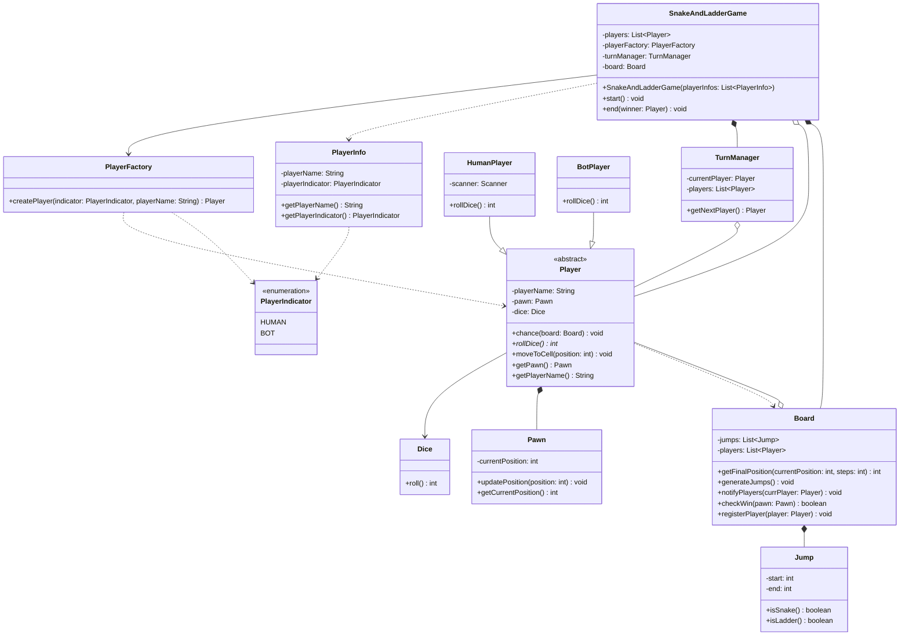
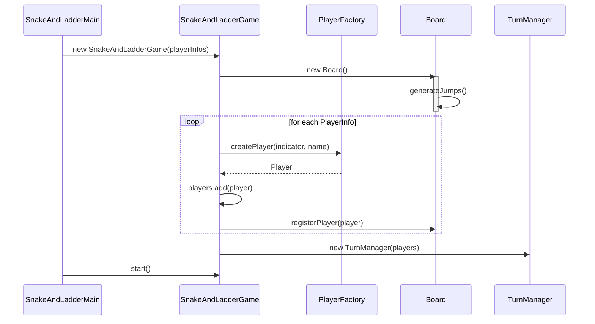

# L3 — Snake & Ladder System

## Scope

- Single game instance (multi-game deferred, same call as elevator L2)
- Fixed board, 1–100
- Random snake/ladder generation, count randomized within a range, no overlapping start/end cells
- Win = exact landing on 100 (overshoot invalid, pawn stays put)
- Single dice
- Human + Computer players supported (single-player-vs-bot is a real requirement, not just a design flex)

## Entities

- **Board** — owns Jumps (composition), owns Player list as observers (aggregation). Resolves moves, generates jumps, checks win, notifies.
- **Jump** — replaces separate Snake/Ladder classes. `start`, `end`, `isSnake()`/`isLadder()` derived from comparing the two — rejected an interface here since there's no real behavioral fork, only derivable data.
- **PlayerInfo** — added mid-implementation, not in original design pass. Bundles `name` + `PlayerIndicator` together for setup, since neither a `Map` nor a raw pair fit (no lookup need, and Java lacks a first-class `Pair`) — same reasoning previously applied to `Jump`.
- **Player** (abstract) — Template Method host. Owns Pawn (composition) and Dice (association, shared-style usage). Holds `board` only as a method parameter, never a stored field — kept explicitly transient so a Player instance stays reusable across multiple games (ties back to the Player/Pawn lifecycle split).
- **HumanPlayer / BotPlayer** — extend Player, differ in `rollDice()`. HumanPlayer blocks on a console prompt (`Scanner.nextLine()`) before rolling; BotPlayer rolls instantly. This is the real behavioral fork justifying Template Method.
- **Pawn** — transient, tied to Player for one game's duration; separated from Player because stats (persistent) and position (transient) have different lifecycles.
- **Dice** — owns random generation, single `roll()`.
- **TurnManager** — owns "who's next" only; does not own the game loop or win-check (kept outside per the L2 lesson on driver-controlled loops).
- **SnakeAndLadderGame** — owns the loop (`while(true)` + `break`), orchestrates Board/TurnManager/Player, calls `end()`.

## Key Design Decisions

- **Board resolves the full move in one call.** `getFinalPosition(currPos, steps)` returns the _fully resolved_ position (raw move + jump applied) so there's no duplicate jump-check logic sitting in both Board and Player.
- **Game owns the loop, not TurnManager.** Directly reapplies the L2 "primitive-step methods, driver keeps control" lesson — TurnManager only answers "who's next," Game decides when to stop.
- **checkWin() takes Pawn, not a stored position.** Avoids Board keeping a shadow copy of position state that Pawn already owns as source of truth.
- **notifyPlayers() fires unconditionally, win-check is a separate branch after.** Every move gets broadcast regardless of outcome; `end()` is an additional step layered on top when `checkWin()` is true, not a replacement for notification.
- **Board() constructor triggers generateJumps() internally** — jump generation is Board's own setup responsibility, not something Game explicitly orchestrates as a separate call.
- **Player creation moved from `start()` into the constructor** during implementation — `SnakeAndLadderGame(List<PlayerInfo>)` now builds and registers players at construction time; `start()` only runs the turn loop. Cleaner separation between setup and execution than the original design.

## Patterns Used

**Template Method — `Player.chance(board)`**

- Fixed sequence: roll → get final position → move pawn. Only `rollDice()` varies.
- `chance()` is `final` — inherited and callable, but the skeleton itself cannot be overridden, only the abstract step inside it.
- Real second implementation confirmed in code: `HumanPlayer` blocks on console input, `BotPlayer` rolls instantly.

**Observer — Board (Subject) → Player (Observer)**

- Weaker justification than Template Method/Factory: no second subscriber type exists _today_, but a plausible future one does (tournament/broadcast audience). Used deliberately for decoupling-for-extension, not because two concrete subscribers exist right now.

**Factory Method — `PlayerFactory.createPlayer(indicator, name)`**

- One type indicator in, one concrete Player subtype out. Looping/counting how many of each type stays in Game — not the Factory's job.
- Rejected for Jump generation: no type variation, pure random data, would be over-engineering.

## Design Smells Caught During This Session

- Premature interface for Snake/Ladder — no real second implementation, collapsed to one `Jump` class.
- Same responsibility (jump resolution) initially duplicated across Board and Player — resolved by making `getFinalPosition()` the single owner of full resolution.
- Contradiction between "TurnManager checks win after each player" and "no loop needed" — self-corrected once traced against own description of the flow.
- `Player` almost given a permanent `-board: Board` field — caught against own earlier reasoning that Player must outlive any single game; fixed to pass Board as a parameter instead.
- `TurnManager` almost given a redundant `currPlayer` constructor param — caught by tracing the chicken-and-egg problem at setup time (no current player exists yet when TurnManager is created).
- Class diagram arrow/field mismatches (solid arrow implying a stored field that didn't exist in the class body) — recurring issue during design, resolved by auditing each relationship against its class body systematically.

## Bugs Found + Fixed (in code)

- `Board.getFinalPosition()` computed the jump-resolved position correctly but returned the raw unresolved value instead — dead logic, fixed to return the computed variable.
- `Jump` resolution logic originally branched on `isSnake()`/`isLadder()` with mismatched add/subtract math instead of direct reassignment — simplified to one unified `start → end` check, since direction is already encoded in which value is bigger.
- `Board.generateJumps()` never added accepted cells to the dedup `Set`, and had an inverted `!isEmpty()` guard that silently produced zero jumps every run — fixed by adding `cellSet.add()` calls and removing the incorrect guard.
- Missing `start != end` guard in jump generation — a jump could point to itself.
- `TurnManager.getNextPlayer()` never reassigned `currentPlayer` after computing it — always returned the same player. Fixed by assigning before returning.
- `HumanPlayer`/`BotPlayer` originally duplicated `Dice`/`Pawn` fields already owned by parent `Player` — removed, subclasses use inherited accessors instead.
- `BotPlayer.rollDice()` was hardcoded to return `0` — fixed to call `getDice().roll()`.
- `HumanPlayer`'s `Scanner` was being closed after every roll, which closes the underlying `System.in` stream and breaks all subsequent reads — fixed by making `Scanner` a field created once in the constructor.
- `SnakeAndLadderGame` constructor called `board.registerPlayer()` before `board` was initialized (NPE), and separately before `players` list was initialized (NPE) — both fixed by correct initialization ordering.
- `PlayerFactory` threw `IllegalAccessError` for invalid enum input — wrong exception type, corrected to `IllegalArgumentException`.

## Known Deviations from Original Design (intentional, documented)

- `Board.notifyPlayers()` takes `Player` instead of `Pawn` as originally diagrammed — derives the pawn internally via `player.getPawn()`. Functionally equivalent, not re-aligned to the original signature.
- `SnakeAndLadderGame` entry point moved: player setup now happens in the constructor (`List<PlayerInfo>`), not in `start()` (`List<PlayerIndicator>`) as originally diagrammed.
- Driver class named `SnakeAndLadderMain`, per the L2 naming precedent (`ElevatorMain`) rather than L1's bare `Main` — repo-wide inconsistency with L1 noted, not resolved this session.

## Diagrams

### Class Diagram



### Sequence Diagram — Game Setup



### Sequence Diagram — Player Turn Flow

```mermaid
sequenceDiagram
    participant SnakeAndLadderGame
    participant TurnManager
    participant Player
    participant Dice
    participant Board
    participant Pawn

    loop until checkWin == true
        SnakeAndLadderGame->>TurnManager: getNextPlayer()
        TurnManager-->>SnakeAndLadderGame: Player

        SnakeAndLadderGame->>Player: chance(board)
        activate Player
        Note over Player: HumanPlayer blocks on console input here;<br/>BotPlayer rolls instantly — the one varying step
        Player->>Dice: roll()
        Dice-->>Player: int
        Player->>Pawn: getCurrentPosition()
        Pawn-->>Player: int
        Player->>Board: getFinalPosition(currentPosition, steps)
        Board-->>Player: int
        Player->>Player: moveToCell(finalPosition)
        Player->>Pawn: updatePosition(finalPosition)
        deactivate Player

        SnakeAndLadderGame->>Player: getPawn()
        Player-->>SnakeAndLadderGame: Pawn

        SnakeAndLadderGame->>Board: checkWin(pawn)
        Board-->>SnakeAndLadderGame: boolean

        SnakeAndLadderGame->>Board: notifyPlayers(currentPlayer)

        alt checkWin == true
            SnakeAndLadderGame->>SnakeAndLadderGame: end(currentPlayer)
        end
    end
```
