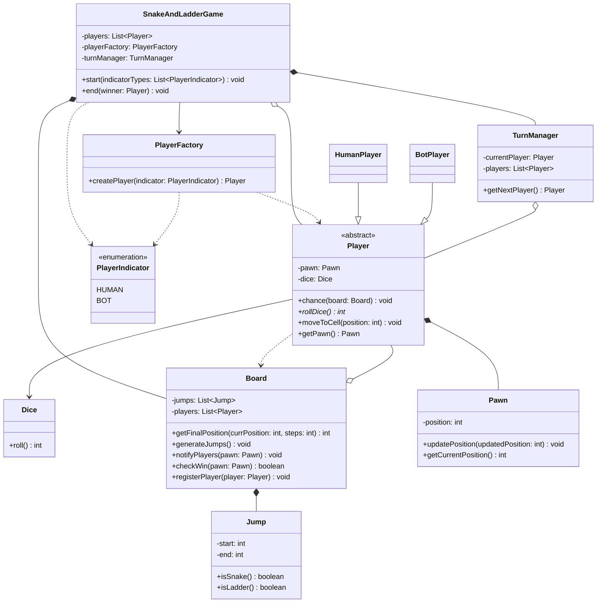
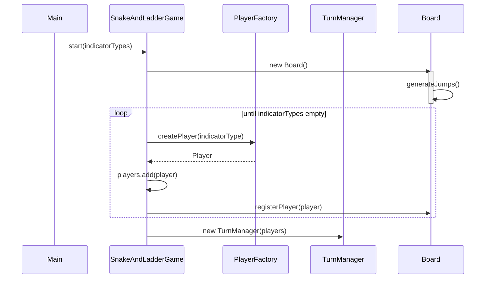
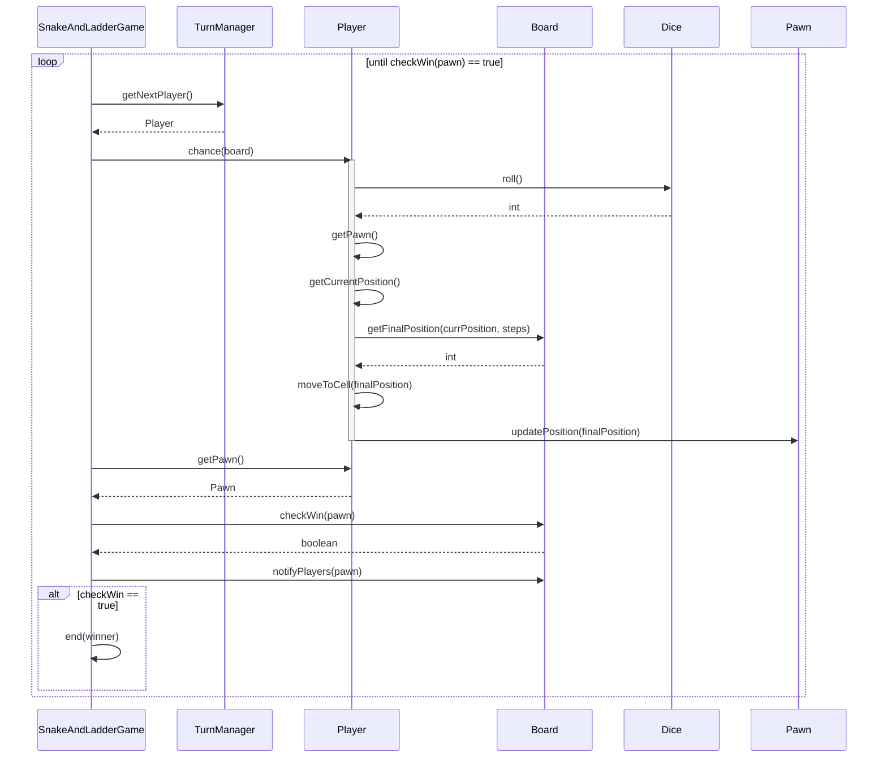

# L3 — Snake & Ladder System

## Scope

- Single game instance (multi-game deferred, same call as elevator L2)
- Fixed board, 1–100
- Random snake/ladder generation, count randomized within a range, no overlapping start/end cells
- Win = exact landing on 100 (overshoot invalid, pawn stays put)
- Single dice
- Human + Computer players supported (single-player-vs-bot is a real requirement, not just a design flex)

## Entities

- **Board** — owns Jumps (composition), owns Player list as observers (aggregation). Resolves moves, generates jumps, checks win, notifies.
- **Jump** — replaces separate Snake/Ladder classes. `start`, `end`, `isSnake()`/`isLadder()` derived from comparing the two — rejected an interface here since there's no real behavioral fork, only derivable data.
- **Player** (abstract) — Template Method host. Owns Pawn (composition) and Dice (association, shared-style usage). Holds `board` only as a method parameter, never a stored field — kept explicitly transient so a Player instance stays reusable across multiple games (ties back to the Player/Pawn lifecycle split).
- **HumanPlayer / BotPlayer** — extend Player, differ only in `rollDice()`.
- **Pawn** — transient, tied to Player for one game's duration; separated from Player because stats (persistent) and position (transient) have different lifecycles.
- **Dice** — owns random generation, single `roll()`.
- **TurnManager** — owns "who's next" only; does not own the game loop or win-check (kept outside per the L2 lesson on driver-controlled loops).
- **SnakeAndLadderGame** — owns the loop (`while(!gameOver)`), orchestrates Board/TurnManager/Player, calls `end()`.

## Key Design Decisions

- **Board resolves the full move in one call.** `getFinalPosition(currPos, steps)` returns the _fully resolved_ position (raw move + jump applied) so there's no duplicate jump-check logic sitting in both Board and Player.
- **Game owns the loop, not TurnManager.** Directly reapplies the L2 "primitive-step methods, driver keeps control" lesson — TurnManager only answers "who's next," Game decides when to stop.
- **checkWin() takes Pawn, not a stored position.** Avoids Board keeping a shadow copy of position state that Pawn already owns as source of truth.
- **notifyPlayers() fires unconditionally, win-check is a separate branch after.** Every move gets broadcast regardless of outcome; `end()` is an additional step layered on top when `checkWin()` is true, not a replacement for notification.
- **Board() constructor triggers generateJumps() internally** — jump generation is Board's own setup responsibility, not something Game explicitly orchestrates as a separate call.

## Patterns Used

**Template Method — `Player.chance(board)`**

- Fixed sequence: roll → get final position → move pawn. Only `rollDice()` varies.
- `chance()` is `final` — inherited and callable, but the skeleton itself cannot be overridden, only the abstract step inside it.
- Real second implementation today (Human waits on input, Bot rolls instantly) — not a forced fit.

**Observer — Board (Subject) → Player (Observer)**

- Weaker justification than Template Method/Factory: no second subscriber type exists _today_, but a plausible future one does (tournament/broadcast audience). Used deliberately for decoupling-for-extension, not because two concrete subscribers exist right now — worth stating this distinction explicitly if asked in an interview.

**Factory Method — `PlayerFactory.createPlayer(indicator)`**

- One type indicator in, one concrete Player subtype out. Looping/counting how many of each type stays in Game — not the Factory's job.
- Rejected for Jump generation: no type variation, pure random data, would be over-engineering.

## Design Smells Caught During This Session

- Premature interface for Snake/Ladder — no real second implementation, collapsed to one `Jump` class.
- Same responsibility (jump resolution) initially duplicated across Board and Player — resolved by making `getFinalPosition()` the single owner of full resolution.
- Contradiction between "TurnManager checks win after each player" and "no loop needed" — self-corrected once traced against own description of the flow.
- `Player` almost given a permanent `-board: Board` field — caught against own earlier reasoning that Player must outlive any single game; fixed to pass Board as a parameter instead.
- Class diagram arrow/field mismatches (solid arrow implying a stored field that didn't exist in the class body) — recurring issue this session, resolved by auditing each relationship against its class body systematically.
- `registerPlayer()` used in setup sequence diagram but initially missing from class diagram — caught during final cross-check pass between diagrams.

## Diagrams

### Class Diagram

### Sequence Diagram — Game Setup

### Sequence Diagram — Player Turn Flow

