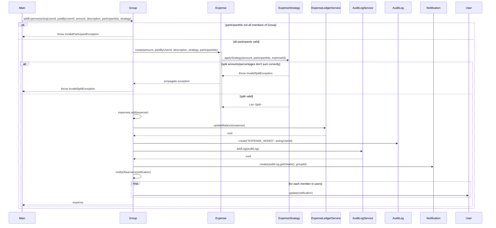
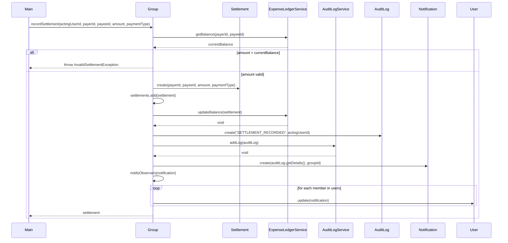

# Splitwise LLD — Notes

## 1. Scope

### In Scope

- Group creation and membership (add/remove members)
- Any group member can edit group details, add/edit/remove expenses — no admin/role concept
- Expense splitting via three strategies: Equal, Percentage, Exact amount
- A member cannot leave a group while they have a non-zero balance in it
- Settlement recording (payer, payee, amount, payment mode: Cash/UPI/Card/Cheque) — updates real balances
- Immutable, append-only activity log for every group action (expense added, member added/removed, settlement recorded)
- Notification to all group members on any group/expense/settlement change (delivery channel mocked — sysout)
- Debt simplification via a min-cash-flow-style greedy graph algorithm
- Group deletion — allowed only if every member's balance is zero (added mid-design, see Known Deviations)
- User deletion — allowed only if the user has zero outstanding balance across every group they belong to

### Out of Scope

- Real payment gateway integration
- Multi-currency support
- Real notification delivery (email/SMS/push) — channel is mocked
- Authentication/authorization — every request assumed already authenticated
- Standalone 1:1 (non-group) expenses — always modeled as a 2-person group instead
- Soft-delete for users — considered, then deliberately dropped (see Known Deviations)

---

## 2. Entities & Classes

| Class                                                                                             | Type                            | Notes                                                                                                                                 |
| ------------------------------------------------------------------------------------------------- | ------------------------------- | ------------------------------------------------------------------------------------------------------------------------------------- |
| `User`                                                                                            | Entity (`models`)               | Implements `Observer`. Identity via `userId`; `equals`/`hashCode` overridden on `userId`.                                             |
| `Group`                                                                                           | Coordinator (`core`)            | Implements `Subject`. Owns its own `ExpenseLedgerService` and `AuditLogService`. Central orchestrator for all operational behavior.   |
| `Expense`                                                                                         | Entity (`models`)               | One instance per transaction. Applies its `ExpenseStrategy` internally at construction — never exists in a half-built, unsplit state. |
| `Split`                                                                                           | Entity (`models`)               | One user's resolved share of one `Expense`.                                                                                           |
| `Settlement`                                                                                      | Entity (`models`)               | A real, already-happened payment. Distinct from `SuggestedSettlement`.                                                                |
| `SuggestedSettlement`                                                                             | Entity (`models`)               | Output of `DebtSimplificationService` — a recommendation, not a recorded event. No `paymentType`/`settlementId`/timestamp.            |
| `Notification`                                                                                    | Entity (`models`)               | Fire-and-forget message (message, groupId, timestamp). Not persisted anywhere.                                                        |
| `AuditLog`                                                                                        | Entity (`models`)               | Immutable record of one action (logId, timestamp, action, actorId).                                                                   |
| `PaymentType`                                                                                     | Enum (`constants`)              | `CASH`, `CARD`, `UPI`, `CHEQUE`                                                                                                       |
| `ExpenseStrategy` (+ `EqualExpenseStrategy`, `PercentageExpenseStrategy`, `ExactExpenseStrategy`) | Strategy pattern (`strategies`) | Stateless, reusable — aggregation from `Expense`, not composition.                                                                    |
| `ExpenseLedgerService`                                                                            | Service (`services`)            | One instance per `Group`. Owns the pairwise, directional balance map.                                                                 |
| `AuditLogService`                                                                                 | Service (`services`)            | One instance per `Group`. Owns the immutable log collection.                                                                          |
| `DebtSimplificationService`                                                                       | Service (`services`)            | Stateless utility. Reads a group's net balances, never mutates real state.                                                            |
| `Splitwise`                                                                                       | Coordinator (`core`)            | Thin top-level entry point — registration, group creation/deletion, user deletion only. No operational logic.                         |
| `Observer` / `Subject`                                                                            | Interfaces (`observer`)         | `User` implements `Observer`; `Group` implements `Subject`.                                                                           |

---

## 3. Patterns Applied — and Why

### Strategy (`ExpenseStrategy` + 3 implementations)

Justified by the three-test framework: real, distinct calculation logic per split type (equal division, exact per-user amounts, percentage-based amounts), same interface, genuine polymorphic dispatch chosen by the caller before construction. Concrete scenario: same `addExpense` call site handles pork (equal), medicine (exact), and milk (percentage) without any conditional branching in `Group` or `Expense`.

### Observer (`Subject`/`Group`, `Observer`/`User`)

Justified via concrete trace: `Group.addExpense()` and `Group.recordSettlement()` both trigger `notifyObservers()`; `Group` never needs to know how many members exist or what each one does with the notification (real one-to-many broadcast, subject stays ignorant of listener count/behavior).

### No Builder

Explicitly evaluated for `Expense` (5 fields, all required every time, no optional/independently-combinable fields) and `AuditLog` (immutability achievable via a plain constructor with `final`-style fields, no combination complexity). Neither qualifies — consistent with L5's correct zero-forced-pattern outcome.

---

## 4. Key Design Decisions

- **ID generation**: entities self-generate their own IDs internally via `UUID.randomUUID()` in their constructors (`Expense`, `AuditLog`, `Settlement`), rather than accepting a caller-supplied ID — except `Group`, which still accepts an externally-supplied `id` (a deliberate, explicit exception, not an inconsistency).
- **Balance storage**: `ExpenseLedgerService` stores a directional pairwise map (`"X-Y"` key = "X owes Y", always non-negative). At most one of `"X-Y"`/`"Y-X"` is ever non-zero at a time — enforced by the update logic itself, not a separate invariant check.
- **Net vs. pairwise balance**: `getNetBalance(userId)` sums a user's position across all pairs (used for the simplification algorithm's input). `hasOutstandingBalance(userId)` checks whether _any single pairwise_ balance involving the user is non-zero (used for `removeMember`/`deleteGroup`/`deleteUser` guards) — these are deliberately different checks. A user can have net-zero balance while still holding live, non-zero pairwise debts that happen to cancel out; removal/deletion must block on the latter, not the former.
- **`actorId` vs. `paidByUserId`/payer/payee**: every mutating action carries a separate `actorId` distinct from the domain fields, matching how real systems separate "who performed this" from "whose data it affects" (see Known Deviations for the simplification applied here).
- **`ExpenseStrategy` relationship**: aggregation, not composition — strategy objects are stateless and reusable across many `Expense` instances, unlike `Split` (owned exclusively, composition).
- **Settlement vs. SuggestedSettlement split**: recording an actual payment (`Settlement`) and suggesting a hypothetical one (`DebtSimplificationService` output) are different classes, since a suggestion has no real `paymentType`/timestamp/persisted ID — reusing `Settlement` for both would have misrepresented data that hasn't actually happened.
- **`AuditLogService`/`ExpenseLedgerService` ownership**: both scoped one-per-`Group` (composition), not global services — required for correct per-group balance/log isolation, and specifically drove the decision to keep `Splitwise` from holding a direct reference to either.

---

## 5. Design Smells Caught During Review

- **Inverted boolean logic**: `User.isActive()` initially returned `deleted` directly instead of `!deleted` — a brand-new user would have read as inactive.
- **Silent map-key collision**: initial balance-key concatenation (`id1 + id2`, no separator) could collide for different user-ID pairs (e.g., `"1"+"23"` vs `"12"+"3"`); fixed with a separator.
- **Balance updates computed but never written back**: an early `updateBalance` draft read a value, mutated a local variable, and never called `.put()` — the map was never actually updated.
- **Direction-blind balance accumulation**: an early ledger design summed every transaction into the same bucket regardless of who owed whom, rather than netting opposing-direction debts against each other.
- **`removeMember` control-flow bug**: an early draft executed the removal _and_ fell through to an unconditional `throw` immediately after — every call would throw regardless of outcome.
- **`removeMember`/`deleteUser` guard bugs**: two separate rounds where the guard condition's polarity was inverted (blocking clear users, allowing indebted users to be removed), and one round using `getNetBalance` (wrong check) instead of `hasOutstandingBalance` (correct check) for the zero-balance gate — a real, substantive distinction, not just a rename.
- **Debt-simplification leftover mismatch**: an early version of the greedy matching loop paired the wrong `userId` with the wrong leftover amount when pushing a partially-settled balance back onto its heap — traced and caught via a concrete numeric example before it shipped.
- **Floating-point exact-equality checks**: multiple validation checks (`allBalanceZero`, `ExactExpenseStrategy`, `PercentageExpenseStrategy`) initially used strict `== 0`/`== 100` comparisons instead of a tolerance band — corrected to `Math.abs(x) > 0.01` throughout.
- **Mutability leaks**: `AuditLogService.getAllLogs()` and several `Group` getters initially returned live internal collection references directly, allowing external mutation of "immutable" state; fixed with `Collections.unmodifiableList(...)`.
- **`equals()`/`hashCode()` gap**: `User` relied on default `Object` identity comparison for `List.contains()` checks in `addMember`/`removeMember` until explicitly overridden on `userId`.

---

## 6. Bugs Found & Fixed (Code Phase)

1. `User.isActive()` inverted condition
2. `Expense` class misspelled `Expenses`, and constructor missing `participantIds` parameter needed by the strategy
3. `Settlement.getSettlement()` misleadingly named (should read as `getSettlementId()`)
4. `EqualExpenseStrategy` remainder computed via unrelated integer modulo instead of true rounding leftover
5. `ExactExpenseStrategy`/`PercentageExpenseStrategy` — missing under-allocation validation (only checked over-allocation initially)
6. `ExpenseLedgerService.updateBalance` — null-unsafe map read, and computed value never written back
7. `ExpenseLedgerService` balance key — collision risk from missing separator; later, direction-blind accumulation instead of netting
8. `getNetBalance` — used `==` for string comparison instead of `.equals()`; iterated all keys without checking if the target user was actually part of each pair
9. `allBalanceZero()` — inverted return logic
10. `Group.removeMember` — unconditional throw after successful removal; later, guard polarity inverted; later, wrong balance-check method used (`getNetBalance` instead of `hasOutstandingBalance`)
11. `Group.addExpense` — wrong exception class used for participant validation; `Expense`/`AuditLog` constructor argument mismatches (missing/misplaced ID)
12. `Group.recordSettlement` — settlement constructed with the total owed amount instead of the actual amount being paid (would have misrecorded partial settlements)
13. `Splitwise.deleteUser` — initially hard-removed the user despite soft-delete being the design (later resolved by deliberately dropping soft-delete altogether, see below)
14. `DebtSimplificationService.simplify` — leftover balance pushed back with the wrong `userId` paired to the wrong amount

---

## 7. Known Deviations from Standard/Market-Common LLD

1. **Debt simplification (min-cash-flow graph algorithm) is in scope** — most standard Splitwise LLD interview treatments scope this out as a bonus round; here it's a first-class required feature.
2. **`actorId = paidByUserId` always assumed** — real systems (and more rigorous LLD treatments) typically derive the acting user from a separate session/auth context, independent of domain fields like `paidBy`. This system has no auth layer, so `actorId` is passed explicitly as a parameter rather than derived from context — a deliberate, acknowledged simplification, not an oversight.
3. **`DebtSimplificationService` as a plain instantiated service** (not static, not injected) — a conscious, simple choice appropriate for this LLD's scope; a static-utility alternative was considered and explicitly rejected in favor of standard OOP instantiation for testability.
4. **Group deletion was not in the original locked requirements** — added mid-design as a scope addition, with the rule: deletable only if every member's balance is zero (not just the initiator's).
5. **ID generation convention**: all entities self-generate UUIDs internally except `Group`, which still accepts an externally-supplied ID — an intentional, single documented exception rather than a system-wide rule.
6. **Soft-delete for users was designed, then deliberately removed.** The original design gave `User` an `isActive`/`deleted` flag specifically to preserve referential integrity for the immutable audit log. On review, since every reference to a user throughout the system (`AuditLog.actorId`, `Split.userId`, `Settlement.payer/payee`) is a plain `String` ID — never a live object reference — hard-deleting a `User` from `Splitwise`'s map does not corrupt any historical data. This was a conscious simplification for this LLD's scope; a production system handling compliance/audit requirements would very likely still soft-delete.

---

## 8. Diagrams

### 8.1 Class Diagram

```mermaid
classDiagram
    class Observer {
        <<interface>>
        +update(notification: Notification) void
    }

    class Subject {
        <<interface>>
        +notifyObservers(notification: Notification) void
    }

    class User {
        -String userId
        -String name
        -String email
        -String phone
    }

    class Group {
        -String groupId
        -String groupName
        -ExpenseLedgerService expenseLedgerService
        -AuditLogService auditLogService
        -List~User~ users
        -List~Expense~ expenses
        -List~Settlement~ settlements
        +addMember(user: User) void
        +removeMember(user: User) void
        +addExpense(actingUserId, paidByUserId, amount, description, participantIds, strategy) Expense
        +recordSettlement(actingUserId, payerId, payeeId, amount, paymentType) Settlement
        +canBeDeleted() boolean
        +simplifyDebt() List~SuggestedSettlement~
        +notifyObservers(notification: Notification) void
        +getGroupId() String
        +getGroupName() String
        +getExpenseLedgerService() ExpenseLedgerService
        +getAuditLogService() AuditLogService
        +getUsers() List~User~
        +getExpenses() List~Expense~
        +getSettlements() List~Settlement~
    }

    class ExpenseStrategy {
        <<interface>>
        +applyStrategy(amount, participantIds, expenseId) List~Split~
    }

    class EqualExpenseStrategy
    class PercentageExpenseStrategy
    class ExactExpenseStrategy

    class Expense {
        -String expenseId
        -double amount
        -String paidBy
        -String description
        -ExpenseStrategy strategy
        -List~Split~ splits
        +getAllSplits() List~Split~
    }

    class Split {
        -String userId
        -String expenseId
        -double amountOwed
    }

    class Settlement {
        -String settlementId
        -String payer
        -String payee
        -double amount
        -PaymentType paymentType
        -LocalDateTime timeStamp
    }

    class SuggestedSettlement {
        -String payerId
        -String payeeId
        -double amount
    }

    class ExpenseLedgerService {
        -Map~String, Double~ balances
        +updateBalance(expense: Expense) void
        +updateBalance(settlement: Settlement) void
        +getBalance(userId1, userId2) double
        +getNetBalance(userId) double
        +allBalanceZero() boolean
        +hasOutstandingBalance(userId) boolean
    }

    class DebtSimplificationService {
        +simplify(group: Group) List~SuggestedSettlement~
    }

    class AuditLog {
        -String logId
        -LocalDateTime timeStamp
        -String action
        -String actorId
        +getDetails() String
    }

    class AuditLogService {
        -List~AuditLog~ auditLogs
        +addLog(log: AuditLog) void
        +getAllLogs() List~AuditLog~
    }

    class Notification {
        -String message
        -String groupId
        -LocalDateTime timestamp
    }

    class PaymentType {
        <<enumeration>>
        CASH
        CARD
        UPI
        CHEQUE
    }

    class Splitwise {
        -Map~String, User~ users
        -Map~String, Group~ groups
        +registerUser(user: User) void
        +createGroup(id, name) Group
        +deleteGroup(groupId) void
        +deleteUser(userId) void
    }

    Splitwise *-- Group
    Splitwise *-- User
    Group ..|> Subject
    Group *-- Expense
    Group *-- Notification
    Group *-- AuditLogService
    Group *-- ExpenseLedgerService
    Group *-- Settlement
    Group o-- User
    Group ..> DebtSimplificationService
    DebtSimplificationService ..> SuggestedSettlement
    Expense *-- Split
    Expense o-- ExpenseStrategy
    User ..|> Observer
    ExactExpenseStrategy ..|> ExpenseStrategy
    PercentageExpenseStrategy ..|> ExpenseStrategy
    EqualExpenseStrategy ..|> ExpenseStrategy
    User --> Notification
    Settlement --> PaymentType
    AuditLogService *-- AuditLog
```

### 8.2 Sequence Diagram — Add Expense

### 8.3 Sequence Diagram — Record Settlement

---
